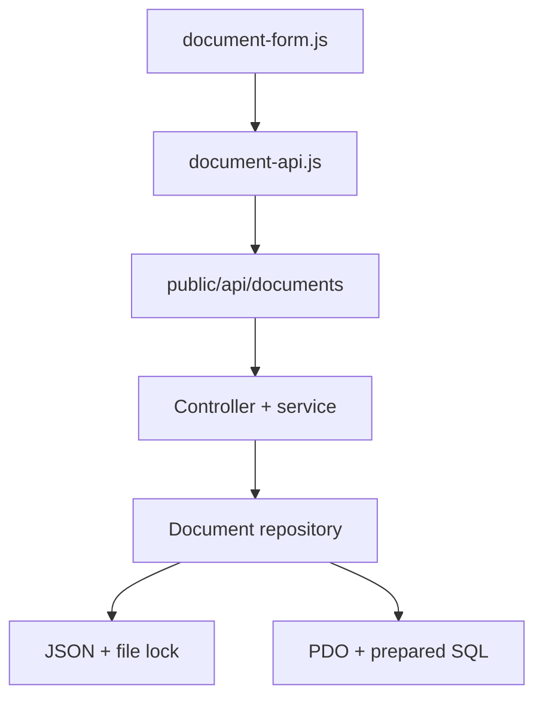

# Audit Log

## 1. UI/UX y desplazamiento

- Se extrajeron del layout principal los tokens activos y se centralizaron en
  `public/src/css/main-menu.css`: fondo `#101732`, texto `#eeeeee`, acento
  `#abbaea`, panel `rgba(16, 23, 50, 0.38)`, campo
  `rgba(8, 12, 28, 0.55)`, bordes blancos al 14–18%, radio principal de
  `30px`, desenfoque de `24px` y transición elástica de `0.6s`.
- `documents-upload.html` y `documents-edit.html` ahora usan la misma estructura
  de `app-shell`, `sidebar`, `sidebar-nav`, `nav-indicator`, `topbar`, marca y
  búsqueda que las vistas principales. La sección Documentos queda activa y
  todas las rutas del menú conservan su profundidad correcta.
- Ambos formularios se reorganizaron en dos superficies compactas: datos y
  archivo. Se conservaron los íconos del proyecto y su cambio de color mediante
  `filter`.
- El tema oscuro sigue siendo el valor predeterminado. Los formularios tienen
  un juego completo de tokens claros activado por `data-theme="light"`; la
  selección existente de Configuración se conserva en `hospitalTheme`.
- En escritorio, `document-content-card` usa `calc(100dvh - 87px)` y el panel
  interno absorbe únicamente el desborde necesario. En anchos menores a 920 px
  el layout pasa a una columna y vuelve al desplazamiento natural del documento.
- No se bloqueó el eje vertical en `html` ni `body`. Ambos mantienen
  `overscroll-behavior-y: auto`; el panel usa `overflow-y: auto` y vuelve a
  `overflow-y: visible` en móvil. No hay una barra de desplazamiento cuando el
  contenido cabe en la altura normal.
- Se añadieron estados de foco, arrastre, archivo seleccionado, envío, éxito y
  error; también se respeta `prefers-reduced-motion`.

## 2. Simplificaciones y correcciones conservadoras

- Se reemplazaron literales repetidos del chrome principal por variables con
  los mismos valores calculados; el tema oscuro conserva su render original.
- `main-menu.js` sincroniza `aria-expanded` en menú, búsqueda y perfil sin
  cambiar sus enlaces ni tiempos de animación.
- `documents.js` centraliza el cierre de menús contextuales, evita que sus
  botones activen accidentalmente el enlace de la tarjeta y dirige Editar al
  formulario con su `id`.
- Las operaciones de red se movieron a `document-api.js`; la manipulación de la
  interfaz permanece en `document-form.js`.
- Se corrigieron las rutas sensibles a mayúsculas de los íconos de contraseña,
  la ruta de `special-bg.png`, el botón sin cierre en Registro y el ID duplicado
  del formulario de carga.
- Se fusionó la declaración duplicada de `.password-wrapper`, se retiraron las
  reglas comprobablemente huérfanas `.menu-action`, `.menu-icon-img` y
  `.user-control.user-open`, y se eliminaron seis archivos `.DS_Store` del ZIP.

### Patrones dejados intactos para evitar regresiones

- Los bloques repetidos de tarjetas en `trace.html` no se convirtieron en
  plantillas: hoy su orden y nodos exactos son consumidos por filtrado y
  paginación del DOM.
- Los selectores repetidos dentro de `@media` se conservaron porque son
  sobrescrituras responsivas, no duplicados muertos.
- Las vistas y hojas vacías de Reportes, Calendario y Encuestas se conservaron:
  actualmente funcionan como destinos reservados del menú y borrarlas rompería
  rutas existentes.
- Los recursos gráficos sin referencia estática se conservaron porque varios
  son elegidos dinámicamente desde JavaScript o pertenecen a módulos todavía no
  implementados.
- No se aplanó el marcado del visor QR ni se reestructuraron las 18 tarjetas de
  traslados: ambas acciones podrían cambiar tamaños, propagación de clics o
  filtros fuera del alcance solicitado.

## 3. Arquitectura y esquema esperado



La solicitud usa `multipart/form-data`.

| Campo | Tipo | Crear | Editar |
| --- | --- | --- | --- |
| `id_documento` | entero positivo | omitido | obligatorio |
| `nombre` | texto ≤ 150 | obligatorio | obligatorio |
| `paciente` | texto ≤ 80 | obligatorio | obligatorio |
| `fecha` | fecha `YYYY-MM-DD` | obligatorio | obligatorio |
| `categoria` | enum | obligatorio | obligatorio |
| `archivo` | archivo binario validado | obligatorio | opcional |

El objeto normalizado que devuelve la API y guarda JSON es:

```json
{
  "id_documento": 1,
  "nombre": "Informe médico",
  "paciente": "1.234.567-8",
  "fecha_documento": "2026-09-08",
  "categoria": "informe",
  "archivo": {
    "nombre_original": "informe.pdf",
    "nombre_almacenado": "identificador-aleatorio.pdf",
    "tipo_mime": "application/pdf",
    "tamano_bytes": 245760
  },
  "fecha_subida": "2026-09-08T20:15:00Z",
  "fecha_modificacion": "2026-09-08T20:15:00Z"
}
```

En SQL, `archivo` se normaliza en cuatro columnas
(`archivo_nombre_original`, `archivo_nombre_almacenado`, `archivo_tipo_mime`,
`archivo_tamano_bytes`) y las fechas se almacenan como UTC en `DATETIME`.

Toda respuesta usa uno de estos contratos:

```json
{ "success": true, "data": {} }
```

```json
{ "success": false, "error": { "code": "...", "message": "...", "fields": {} } }
```

## 4. Verificación

- Inventario completo revisado: HTML, CSS, JavaScript, PHP, SQL, JSON, SVG y
  archivos raster.
- Referencias locales faltantes: `0`.
- IDs HTML duplicados: `0`.
- Errores de parseo HTML detectados: `0`.
- Hojas CSS con llaves desbalanceadas: `0`.
- Todos los JavaScript pasan `node --check`.
- Todos los JSON se parsean correctamente.
- No existe `overflow-y: hidden` en `html` o `body`.

La ejecución visual en el navegador remoto no pudo completarse porque el canal
de vista previa bloqueó su propia URL local. También queda pendiente ejecutar
`php -l` y una carga HTTP real en el servidor Debian, ya que este entorno no
incluye PHP CLI. Las restricciones de layout, rutas y sintaxis disponibles se
validaron estáticamente; estas dos comprobaciones pendientes se declaran para no
presentar como probado algo que el entorno no permitió ejecutar.
