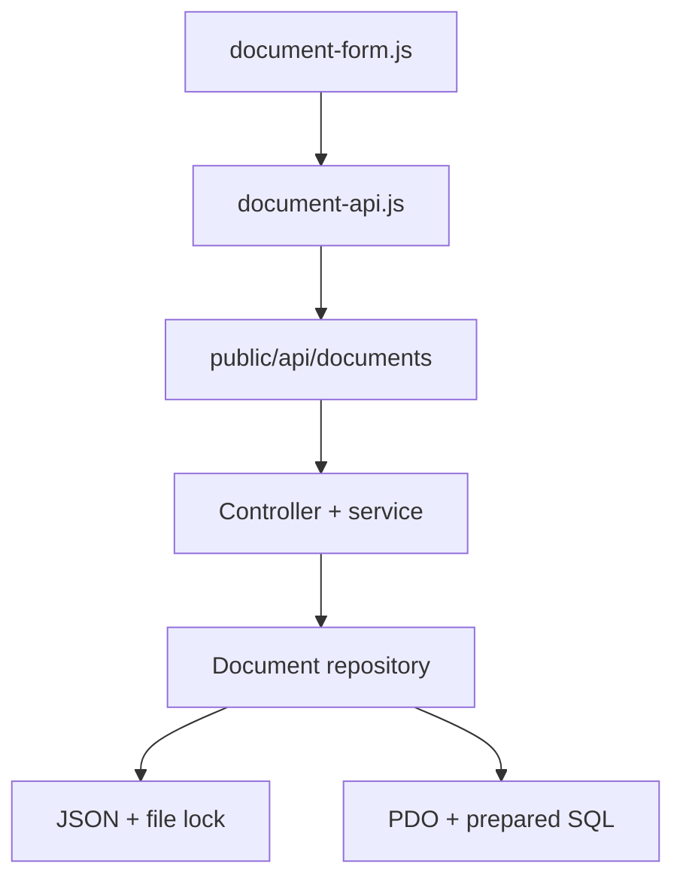

# Full Updated Code

This file contains every added or modified text file. Unchanged project files remain in the ZIP.

### Path: backend/api/documents/create.php

````php
<?php
declare(strict_types=1);

require_once dirname(__DIR__, 2) . '/php/document-controller.php';
handle_document_request('create');
````

### Path: backend/api/documents/update.php

````php
<?php
declare(strict_types=1);

require_once dirname(__DIR__, 2) . '/php/document-controller.php';
handle_document_request('update');
````

### Path: backend/config/documents.env.example

````dotenv
DOCUMENT_STORAGE_DRIVER=json
DOCUMENT_JSON_PATH=
DOCUMENT_UPLOAD_DIR=
DOCUMENT_MAX_UPLOAD_BYTES=10485760
DOCUMENT_LOG_PATH=

# Set DOCUMENT_STORAGE_DRIVER=pdo and configure these values to use MySQL.
DOCUMENT_DB_DSN=mysql:host=127.0.0.1;port=3306;dbname=hospital;charset=utf8mb4
DOCUMENT_DB_USER=hospital_app
DOCUMENT_DB_PASSWORD=change-me
````

### Path: backend/config/documents.php

````php
<?php
declare(strict_types=1);

$projectRoot = dirname(__DIR__, 2);
$configuredLimit = (int) (getenv('DOCUMENT_MAX_UPLOAD_BYTES') ?: 10485760);

return [
    'storage_driver' => strtolower(getenv('DOCUMENT_STORAGE_DRIVER') ?: 'json'),
    'json_path' => getenv('DOCUMENT_JSON_PATH') ?: $projectRoot . '/db/json/documents.json',
    'upload_dir' => getenv('DOCUMENT_UPLOAD_DIR') ?: dirname(__DIR__) . '/storage/documents',
    'log_path' => getenv('DOCUMENT_LOG_PATH') ?: $projectRoot . '/logs/documents.log',
    'max_upload_bytes' => $configuredLimit > 0 ? $configuredLimit : 10485760,
    'allowed_mime_types' => [
        'application/pdf' => ['pdf'],
        'application/vnd.openxmlformats-officedocument.wordprocessingml.document' => ['docx'],
        'application/zip' => ['docx'],
        'image/jpeg' => ['jpg', 'jpeg'],
        'image/png' => ['png'],
    ],
    'categories' => ['informe', 'estudio', 'administrativo'],
    'pdo' => [
        'dsn' => getenv('DOCUMENT_DB_DSN') ?: '',
        'username' => getenv('DOCUMENT_DB_USER') ?: '',
        'password' => getenv('DOCUMENT_DB_PASSWORD') ?: '',
    ],
];
````

### Path: backend/php/actualizar_doc.php

````php
<?php
declare(strict_types=1);

require_once dirname(__DIR__) . '/api/documents/update.php';
````

### Path: backend/php/document-controller.php

````php
<?php
declare(strict_types=1);

require_once __DIR__ . '/http.php';
require_once __DIR__ . '/document-service.php';

function handle_document_request(string $operation): void
{
    if (($_SERVER['REQUEST_METHOD'] ?? '') !== 'POST') {
        header('Allow: POST');
        document_json_response(405, false, null, [
            'code' => 'method_not_allowed',
            'message' => 'Este endpoint solo acepta solicitudes POST.',
        ]);
    }

    try {
        $data = $operation === 'create'
            ? document_create($_POST, $_FILES)
            : document_update($_POST, $_FILES);

        document_json_response($operation === 'create' ? 201 : 200, true, $data);
    } catch (DocumentRequestException $error) {
        $details = [
            'code' => $error->errorCode(),
            'message' => $error->getMessage(),
        ];

        if ($error->fields() !== []) {
            $details['fields'] = $error->fields();
        }

        document_json_response($error->status(), false, null, $details);
    } catch (Throwable $error) {
        document_log_error($error);
        document_json_response(500, false, null, [
            'code' => 'internal_error',
            'message' => 'No se pudo procesar el documento. Intentá nuevamente.',
        ]);
    }
}

function document_log_error(Throwable $error): void
{
    $config = document_config();
    $logDirectory = dirname($config['log_path']);

    if (!is_dir($logDirectory)) {
        mkdir($logDirectory, 0750, true);
    }

    $line = sprintf(
        "[%s] %s in %s:%d%s",
        gmdate('c'),
        $error->getMessage(),
        $error->getFile(),
        $error->getLine(),
        PHP_EOL
    );

    error_log($line, 3, $config['log_path']);
}
````

### Path: backend/php/document-repository.php

````php
<?php
declare(strict_types=1);

final class DocumentRepositoryException extends RuntimeException
{
}

function document_repository_find(int $id, array $config): ?array
{
    if ($config['storage_driver'] === 'json') {
        foreach (document_json_read($config['json_path']) as $record) {
            if ((int) ($record['id_documento'] ?? 0) === $id) {
                return $record;
            }
        }

        return null;
    }

    $pdo = document_pdo($config);
    $statement = $pdo->prepare('SELECT * FROM documentos WHERE id_documento = :id_documento');
    $statement->execute(['id_documento' => $id]);
    $row = $statement->fetch();

    return $row ? document_record_from_row($row) : null;
}

function document_repository_create(array $record, array $config): array
{
    if ($config['storage_driver'] === 'json') {
        return document_json_mutate($config['json_path'], function (array &$records) use ($record): array {
            $nextId = 1;

            foreach ($records as $existing) {
                $nextId = max($nextId, (int) ($existing['id_documento'] ?? 0) + 1);
            }

            $record['id_documento'] = $nextId;
            $records[] = $record;

            return $record;
        });
    }

    $pdo = document_pdo($config);
    $statement = $pdo->prepare(
        'INSERT INTO documentos (
            nombre,
            paciente_referencia,
            fecha_documento,
            categoria,
            archivo_nombre_original,
            archivo_nombre_almacenado,
            archivo_tipo_mime,
            archivo_tamano_bytes,
            fecha_subida,
            fecha_modificacion
        ) VALUES (
            :nombre,
            :paciente_referencia,
            :fecha_documento,
            :categoria,
            :archivo_nombre_original,
            :archivo_nombre_almacenado,
            :archivo_tipo_mime,
            :archivo_tamano_bytes,
            :fecha_subida,
            :fecha_modificacion
        )'
    );
    $statement->execute(document_record_parameters($record));
    $record['id_documento'] = (int) $pdo->lastInsertId();

    return $record;
}

function document_repository_update(array $record, array $config): array
{
    if ($config['storage_driver'] === 'json') {
        return document_json_mutate($config['json_path'], function (array &$records) use ($record): array {
            foreach ($records as $index => $existing) {
                if ((int) ($existing['id_documento'] ?? 0) === (int) $record['id_documento']) {
                    $records[$index] = $record;
                    return $record;
                }
            }

            throw new DocumentRepositoryException('Document not found.');
        });
    }

    $pdo = document_pdo($config);
    $statement = $pdo->prepare(
        'UPDATE documentos SET
            nombre = :nombre,
            paciente_referencia = :paciente_referencia,
            fecha_documento = :fecha_documento,
            categoria = :categoria,
            archivo_nombre_original = :archivo_nombre_original,
            archivo_nombre_almacenado = :archivo_nombre_almacenado,
            archivo_tipo_mime = :archivo_tipo_mime,
            archivo_tamano_bytes = :archivo_tamano_bytes,
            fecha_subida = :fecha_subida,
            fecha_modificacion = :fecha_modificacion
        WHERE id_documento = :id_documento'
    );
    $parameters = document_record_parameters($record);
    $parameters['id_documento'] = $record['id_documento'];
    $statement->execute($parameters);

    if ($statement->rowCount() === 0 && document_repository_find((int) $record['id_documento'], $config) === null) {
        throw new DocumentRepositoryException('Document not found.');
    }

    return $record;
}

function document_json_read(string $path): array
{
    if (!is_file($path)) {
        return [];
    }

    $handle = fopen($path, 'r');
    if ($handle === false) {
        throw new DocumentRepositoryException('The JSON document store could not be opened.');
    }

    try {
        if (!flock($handle, LOCK_SH)) {
            throw new DocumentRepositoryException('The JSON document store could not be locked.');
        }

        $contents = stream_get_contents($handle);
        flock($handle, LOCK_UN);
    } finally {
        fclose($handle);
    }

    if ($contents === false || trim($contents) === '') {
        return [];
    }

    $records = json_decode($contents, true);
    if (!is_array($records)) {
        throw new DocumentRepositoryException('The JSON document store is invalid.');
    }

    return $records;
}

function document_json_mutate(string $path, callable $mutation): array
{
    $directory = dirname($path);
    if (!is_dir($directory) && !mkdir($directory, 0750, true) && !is_dir($directory)) {
        throw new DocumentRepositoryException('The JSON storage directory could not be created.');
    }

    $handle = fopen($path, 'c+');
    if ($handle === false) {
        throw new DocumentRepositoryException('The JSON document store could not be opened.');
    }

    try {
        if (!flock($handle, LOCK_EX)) {
            throw new DocumentRepositoryException('The JSON document store could not be locked.');
        }

        rewind($handle);
        $contents = stream_get_contents($handle);
        $records = trim((string) $contents) === '' ? [] : json_decode((string) $contents, true);

        if (!is_array($records)) {
            throw new DocumentRepositoryException('The JSON document store is invalid.');
        }

        $result = $mutation($records);
        $encoded = json_encode($records, JSON_PRETTY_PRINT | JSON_UNESCAPED_SLASHES | JSON_UNESCAPED_UNICODE);

        if ($encoded === false) {
            throw new DocumentRepositoryException('The document records could not be encoded.');
        }

        rewind($handle);
        if (!ftruncate($handle, 0) || fwrite($handle, $encoded . PHP_EOL) === false || !fflush($handle)) {
            throw new DocumentRepositoryException('The JSON document store could not be written.');
        }

        flock($handle, LOCK_UN);
        return $result;
    } finally {
        fclose($handle);
    }
}

function document_pdo(array $config): PDO
{
    static $connection = null;

    if ($connection instanceof PDO) {
        return $connection;
    }

    if ($config['storage_driver'] !== 'pdo') {
        throw new DocumentRepositoryException('Unsupported document storage driver.');
    }

    if ($config['pdo']['dsn'] === '') {
        throw new DocumentRepositoryException('DOCUMENT_DB_DSN is not configured.');
    }

    $connection = new PDO(
        $config['pdo']['dsn'],
        $config['pdo']['username'],
        $config['pdo']['password'],
        [
            PDO::ATTR_ERRMODE => PDO::ERRMODE_EXCEPTION,
            PDO::ATTR_DEFAULT_FETCH_MODE => PDO::FETCH_ASSOC,
            PDO::ATTR_EMULATE_PREPARES => false,
        ]
    );

    return $connection;
}

function document_record_parameters(array $record): array
{
    return [
        'nombre' => $record['nombre'],
        'paciente_referencia' => $record['paciente'],
        'fecha_documento' => $record['fecha_documento'],
        'categoria' => $record['categoria'],
        'archivo_nombre_original' => $record['archivo']['nombre_original'],
        'archivo_nombre_almacenado' => $record['archivo']['nombre_almacenado'],
        'archivo_tipo_mime' => $record['archivo']['tipo_mime'],
        'archivo_tamano_bytes' => $record['archivo']['tamano_bytes'],
        'fecha_subida' => document_sql_timestamp($record['fecha_subida']),
        'fecha_modificacion' => document_sql_timestamp($record['fecha_modificacion']),
    ];
}

function document_record_from_row(array $row): array
{
    return [
        'id_documento' => (int) $row['id_documento'],
        'nombre' => $row['nombre'],
        'paciente' => $row['paciente_referencia'],
        'fecha_documento' => $row['fecha_documento'],
        'categoria' => $row['categoria'],
        'archivo' => [
            'nombre_original' => $row['archivo_nombre_original'],
            'nombre_almacenado' => $row['archivo_nombre_almacenado'],
            'tipo_mime' => $row['archivo_tipo_mime'],
            'tamano_bytes' => (int) $row['archivo_tamano_bytes'],
        ],
        'fecha_subida' => document_iso_timestamp($row['fecha_subida']),
        'fecha_modificacion' => document_iso_timestamp($row['fecha_modificacion']),
    ];
}

function document_sql_timestamp(string $timestamp): string
{
    return gmdate('Y-m-d H:i:s', strtotime($timestamp));
}

function document_iso_timestamp(string $timestamp): string
{
    return gmdate('Y-m-d\TH:i:s\Z', strtotime($timestamp));
}
````

### Path: backend/php/document-service.php

````php
<?php
declare(strict_types=1);

require_once __DIR__ . '/document-repository.php';

final class DocumentRequestException extends RuntimeException
{
    private $status;
    private $errorCode;
    private $fields;

    public function __construct(int $status, string $errorCode, string $message, array $fields = [])
    {
        parent::__construct($message);
        $this->status = $status;
        $this->errorCode = $errorCode;
        $this->fields = $fields;
    }

    public function status(): int
    {
        return $this->status;
    }

    public function errorCode(): string
    {
        return $this->errorCode;
    }

    public function fields(): array
    {
        return $this->fields;
    }
}

function document_create(array $post, array $files): array
{
    $config = document_config();
    $fields = document_validated_fields($post, $config);
    $file = document_store_upload($files['archivo'] ?? null, true, $config);
    $timestamp = gmdate('Y-m-d\TH:i:s\Z');
    $record = array_merge($fields, [
        'archivo' => $file,
        'fecha_subida' => $timestamp,
        'fecha_modificacion' => $timestamp,
    ]);

    try {
        return document_repository_create($record, $config);
    } catch (Throwable $error) {
        document_remove_stored_file($file['nombre_almacenado'], $config);
        throw $error;
    }
}

function document_update(array $post, array $files): array
{
    $config = document_config();
    $id = filter_var($post['id_documento'] ?? null, FILTER_VALIDATE_INT, ['options' => ['min_range' => 1]]);

    if ($id === false) {
        throw new DocumentRequestException(422, 'validation_error', 'El identificador del documento no es válido.', [
            'id_documento' => 'Debe ser un número entero positivo.',
        ]);
    }

    $existing = document_repository_find((int) $id, $config);
    if ($existing === null) {
        throw new DocumentRequestException(404, 'document_not_found', 'No se encontró el documento solicitado.');
    }

    $fields = document_validated_fields($post, $config);
    $replacement = document_store_upload($files['archivo'] ?? null, false, $config);
    $record = array_merge($existing, $fields, [
        'id_documento' => (int) $id,
        'fecha_modificacion' => gmdate('Y-m-d\TH:i:s\Z'),
    ]);

    if ($replacement !== null) {
        $record['archivo'] = $replacement;
    }

    try {
        $updated = document_repository_update($record, $config);
    } catch (Throwable $error) {
        if ($replacement !== null) {
            document_remove_stored_file($replacement['nombre_almacenado'], $config);
        }
        throw $error;
    }

    if ($replacement !== null && isset($existing['archivo']['nombre_almacenado'])) {
        document_remove_stored_file($existing['archivo']['nombre_almacenado'], $config);
    }

    return $updated;
}

function document_config(): array
{
    static $config = null;

    if ($config === null) {
        $config = require dirname(__DIR__) . '/config/documents.php';
    }

    return $config;
}

function document_validated_fields(array $post, array $config): array
{
    $values = [
        'nombre' => document_clean_text($post['nombre'] ?? '', 150),
        'paciente' => document_clean_text($post['paciente'] ?? '', 80),
        'fecha_documento' => document_clean_text($post['fecha'] ?? '', 10),
        'categoria' => document_clean_text($post['categoria'] ?? '', 32),
    ];
    $errors = [];

    if ($values['nombre'] === '') {
        $errors['nombre'] = 'El nombre es obligatorio.';
    }
    if ($values['paciente'] === '') {
        $errors['paciente'] = 'El paciente o la cédula son obligatorios.';
    }
    if (!document_valid_date($values['fecha_documento'])) {
        $errors['fecha'] = 'La fecha debe usar el formato YYYY-MM-DD.';
    }
    if (!in_array($values['categoria'], $config['categories'], true)) {
        $errors['categoria'] = 'La categoría seleccionada no es válida.';
    }

    if ($errors !== []) {
        throw new DocumentRequestException(422, 'validation_error', 'Revisá los datos ingresados.', $errors);
    }

    return $values;
}

function document_clean_text($value, int $maxLength): string
{
    if (!is_scalar($value)) {
        return '';
    }

    $clean = trim(strip_tags((string) $value));
    $clean = preg_replace('/\s+/u', ' ', $clean) ?? '';

    if (function_exists('mb_substr')) {
        return mb_substr($clean, 0, $maxLength, 'UTF-8');
    }

    return substr($clean, 0, $maxLength);
}

function document_valid_date(string $value): bool
{
    $date = DateTimeImmutable::createFromFormat('!Y-m-d', $value);
    return $date !== false && $date->format('Y-m-d') === $value;
}

function document_store_upload(?array $file, bool $required, array $config): ?array
{
    if ($file === null || (int) ($file['error'] ?? UPLOAD_ERR_NO_FILE) === UPLOAD_ERR_NO_FILE) {
        if ($required) {
            throw new DocumentRequestException(422, 'validation_error', 'Seleccioná un archivo para continuar.', [
                'archivo' => 'El archivo es obligatorio.',
            ]);
        }

        return null;
    }

    $error = (int) ($file['error'] ?? UPLOAD_ERR_NO_FILE);
    if ($error !== UPLOAD_ERR_OK) {
        throw new DocumentRequestException(400, 'upload_error', document_upload_error_message($error));
    }

    $size = (int) ($file['size'] ?? 0);
    if ($size < 1 || $size > $config['max_upload_bytes']) {
        throw new DocumentRequestException(413, 'file_too_large', 'El archivo supera el límite permitido de 10 MB.');
    }

    $temporaryPath = (string) ($file['tmp_name'] ?? '');
    if ($temporaryPath === '' || !is_uploaded_file($temporaryPath)) {
        throw new DocumentRequestException(400, 'invalid_upload', 'El archivo recibido no es una carga válida.');
    }

    $unsafeName = str_replace("\0", '', (string) ($file['name'] ?? 'archivo'));
    $unsafeName = basename(str_replace('\\', '/', $unsafeName));
    $extension = strtolower(pathinfo($unsafeName, PATHINFO_EXTENSION));
    $baseName = document_clean_text(pathinfo($unsafeName, PATHINFO_FILENAME), 240);
    $originalName = ($baseName !== '' ? $baseName : 'archivo') . '.' . $extension;
    if (!function_exists('finfo_open')) {
        throw new DocumentRequestException(500, 'server_configuration_error', 'No se pudo validar el tipo de archivo.');
    }

    $fileInfo = finfo_open(FILEINFO_MIME_TYPE);

    if ($fileInfo === false) {
        throw new DocumentRequestException(500, 'server_configuration_error', 'No se pudo validar el tipo de archivo.');
    }

    $mimeType = (string) finfo_file($fileInfo, $temporaryPath);
    finfo_close($fileInfo);
    $allowedExtensions = $config['allowed_mime_types'][$mimeType] ?? [];

    if (!in_array($extension, $allowedExtensions, true)) {
        throw new DocumentRequestException(415, 'unsupported_file_type', 'El formato debe ser PDF, DOCX, JPG o PNG.');
    }

    $uploadDirectory = $config['upload_dir'];
    if (!is_dir($uploadDirectory) && !mkdir($uploadDirectory, 0750, true) && !is_dir($uploadDirectory)) {
        throw new DocumentRequestException(500, 'storage_unavailable', 'No se pudo preparar el almacenamiento de archivos.');
    }

    $storedName = bin2hex(random_bytes(16)) . '.' . $extension;
    $destination = $uploadDirectory . DIRECTORY_SEPARATOR . $storedName;

    if (!move_uploaded_file($temporaryPath, $destination)) {
        throw new DocumentRequestException(500, 'storage_error', 'No se pudo guardar el archivo recibido.');
    }

    return [
        'nombre_original' => $originalName,
        'nombre_almacenado' => $storedName,
        'tipo_mime' => $mimeType,
        'tamano_bytes' => $size,
    ];
}

function document_remove_stored_file(string $storedName, array $config): void
{
    $safeName = basename($storedName);
    if ($safeName === '' || $safeName !== $storedName) {
        return;
    }

    $path = $config['upload_dir'] . DIRECTORY_SEPARATOR . $safeName;
    if (is_file($path)) {
        unlink($path);
    }
}

function document_upload_error_message(int $error): string
{
    $messages = [
        UPLOAD_ERR_INI_SIZE => 'El archivo supera el límite configurado en el servidor.',
        UPLOAD_ERR_FORM_SIZE => 'El archivo supera el límite indicado por el formulario.',
        UPLOAD_ERR_PARTIAL => 'El archivo se recibió de forma incompleta.',
        UPLOAD_ERR_NO_TMP_DIR => 'El servidor no tiene un directorio temporal disponible.',
        UPLOAD_ERR_CANT_WRITE => 'El servidor no pudo escribir el archivo.',
        UPLOAD_ERR_EXTENSION => 'Una extensión del servidor detuvo la carga.',
    ];

    return $messages[$error] ?? 'No se pudo recibir el archivo.';
}
````

### Path: backend/php/guardar.php

````php
<?php
declare(strict_types=1);

require_once dirname(__DIR__) . '/api/documents/create.php';
````

### Path: backend/php/http.php

````php
<?php
declare(strict_types=1);

function document_json_response(int $status, bool $success, ?array $data = null, ?array $error = null): void
{
    http_response_code($status);
    header('Content-Type: application/json; charset=utf-8');
    header('Cache-Control: no-store');
    header('X-Content-Type-Options: nosniff');

    $payload = ['success' => $success];

    if ($success) {
        $payload['data'] = $data;
    } else {
        $payload['error'] = $error;
    }

    echo json_encode($payload, JSON_UNESCAPED_SLASHES | JSON_UNESCAPED_UNICODE);
    exit;
}
````

### Path: backend/storage/documents/.gitkeep

````text

````

### Path: db/json/document.schema.json

````json
{
  "$schema": "https://json-schema.org/draft/2020-12/schema",
  "$id": "https://hospital.local/schemas/document.schema.json",
  "title": "Documento",
  "type": "object",
  "additionalProperties": false,
  "required": [
    "id_documento",
    "nombre",
    "paciente",
    "fecha_documento",
    "categoria",
    "archivo",
    "fecha_subida",
    "fecha_modificacion"
  ],
  "properties": {
    "id_documento": {
      "type": "integer",
      "minimum": 1
    },
    "nombre": {
      "type": "string",
      "minLength": 1,
      "maxLength": 150
    },
    "paciente": {
      "type": "string",
      "minLength": 1,
      "maxLength": 80
    },
    "fecha_documento": {
      "type": "string",
      "format": "date"
    },
    "categoria": {
      "enum": ["informe", "estudio", "administrativo"]
    },
    "archivo": {
      "type": "object",
      "additionalProperties": false,
      "required": ["nombre_original", "nombre_almacenado", "tipo_mime", "tamano_bytes"],
      "properties": {
        "nombre_original": {
          "type": "string",
          "minLength": 1,
          "maxLength": 255
        },
        "nombre_almacenado": {
          "type": "string",
          "pattern": "^[a-f0-9]{32}\\.(pdf|docx|jpg|jpeg|png)$"
        },
        "tipo_mime": {
          "enum": [
            "application/pdf",
            "application/vnd.openxmlformats-officedocument.wordprocessingml.document",
            "application/zip",
            "image/jpeg",
            "image/png"
          ]
        },
        "tamano_bytes": {
          "type": "integer",
          "minimum": 1,
          "maximum": 10485760
        }
      }
    },
    "fecha_subida": {
      "type": "string",
      "format": "date-time"
    },
    "fecha_modificacion": {
      "type": "string",
      "format": "date-time"
    }
  }
}
````

### Path: db/json/documents.json

````json
[]
````

### Path: db/sql/documents.sql

````sql
CREATE TABLE documentos (
    id_documento BIGINT UNSIGNED NOT NULL AUTO_INCREMENT,
    nombre VARCHAR(150) NOT NULL,
    paciente_referencia VARCHAR(80) NOT NULL,
    fecha_documento DATE NOT NULL,
    categoria VARCHAR(32) NOT NULL,
    archivo_nombre_original VARCHAR(255) NOT NULL,
    archivo_nombre_almacenado VARCHAR(255) NOT NULL,
    archivo_tipo_mime VARCHAR(127) NOT NULL,
    archivo_tamano_bytes BIGINT UNSIGNED NOT NULL,
    fecha_subida DATETIME NOT NULL,
    fecha_modificacion DATETIME NOT NULL,
    PRIMARY KEY (id_documento),
    UNIQUE KEY uq_documentos_archivo_almacenado (archivo_nombre_almacenado),
    KEY idx_documentos_paciente (paciente_referencia),
    KEY idx_documentos_fecha (fecha_documento),
    KEY idx_documentos_categoria (categoria),
    CONSTRAINT chk_documentos_categoria
        CHECK (categoria IN ('informe', 'estudio', 'administrativo')),
    CONSTRAINT chk_documentos_archivo_tamano
        CHECK (archivo_tamano_bytes BETWEEN 1 AND 10485760)
) ENGINE=InnoDB DEFAULT CHARSET=utf8mb4 COLLATE=utf8mb4_unicode_ci;
````

### Path: docs/AUDIT_LOG.md

````markdown
# Audit Log

## 1. UI/UX y desplazamiento

- Se extrajeron del layout principal los tokens activos y se centralizaron en
  `public/src/css/main-menu.css`: fondo `#101732`, texto `#eeeeee`, acento
  `#abbaea`, panel `rgba(16, 23, 50, 0.38)`, campo
  `rgba(8, 12, 28, 0.55)`, bordes blancos al 14–18%, radio principal de
  `30px`, desenfoque de `24px` y transición elástica de `0.6s`.
- `documents-upload.html` y `documents-edit.html` ahora usan la misma estructura
  de `app-shell`, `sidebar`, `sidebar-nav`, `nav-indicator`, `topbar`, marca y
  búsqueda que las vistas principales. La sección Documentos queda activa y
  todas las rutas del menú conservan su profundidad correcta.
- Ambos formularios se reorganizaron en dos superficies compactas: datos y
  archivo. Se conservaron los íconos del proyecto y su cambio de color mediante
  `filter`.
- El tema oscuro sigue siendo el valor predeterminado. Los formularios tienen
  un juego completo de tokens claros activado por `data-theme="light"`; la
  selección existente de Configuración se conserva en `hospitalTheme`.
- En escritorio, `document-content-card` usa `calc(100dvh - 87px)` y el panel
  interno absorbe únicamente el desborde necesario. En anchos menores a 920 px
  el layout pasa a una columna y vuelve al desplazamiento natural del documento.
- No se bloqueó el eje vertical en `html` ni `body`. Ambos mantienen
  `overscroll-behavior-y: auto`; el panel usa `overflow-y: auto` y vuelve a
  `overflow-y: visible` en móvil. No hay una barra de desplazamiento cuando el
  contenido cabe en la altura normal.
- Se añadieron estados de foco, arrastre, archivo seleccionado, envío, éxito y
  error; también se respeta `prefers-reduced-motion`.

## 2. Simplificaciones y correcciones conservadoras

- Se reemplazaron literales repetidos del chrome principal por variables con
  los mismos valores calculados; el tema oscuro conserva su render original.
- `main-menu.js` sincroniza `aria-expanded` en menú, búsqueda y perfil sin
  cambiar sus enlaces ni tiempos de animación.
- `documents.js` centraliza el cierre de menús contextuales, evita que sus
  botones activen accidentalmente el enlace de la tarjeta y dirige Editar al
  formulario con su `id`.
- Las operaciones de red se movieron a `document-api.js`; la manipulación de la
  interfaz permanece en `document-form.js`.
- Se corrigieron las rutas sensibles a mayúsculas de los íconos de contraseña,
  la ruta de `special-bg.png`, el botón sin cierre en Registro y el ID duplicado
  del formulario de carga.
- Se fusionó la declaración duplicada de `.password-wrapper`, se retiraron las
  reglas comprobablemente huérfanas `.menu-action`, `.menu-icon-img` y
  `.user-control.user-open`, y se eliminaron seis archivos `.DS_Store` del ZIP.

### Patrones dejados intactos para evitar regresiones

- Los bloques repetidos de tarjetas en `trace.html` no se convirtieron en
  plantillas: hoy su orden y nodos exactos son consumidos por filtrado y
  paginación del DOM.
- Los selectores repetidos dentro de `@media` se conservaron porque son
  sobrescrituras responsivas, no duplicados muertos.
- Las vistas y hojas vacías de Reportes, Calendario y Encuestas se conservaron:
  actualmente funcionan como destinos reservados del menú y borrarlas rompería
  rutas existentes.
- Los recursos gráficos sin referencia estática se conservaron porque varios
  son elegidos dinámicamente desde JavaScript o pertenecen a módulos todavía no
  implementados.
- No se aplanó el marcado del visor QR ni se reestructuraron las 18 tarjetas de
  traslados: ambas acciones podrían cambiar tamaños, propagación de clics o
  filtros fuera del alcance solicitado.

## 3. Arquitectura y esquema esperado



La solicitud usa `multipart/form-data`.

| Campo | Tipo | Crear | Editar |
| --- | --- | --- | --- |
| `id_documento` | entero positivo | omitido | obligatorio |
| `nombre` | texto ≤ 150 | obligatorio | obligatorio |
| `paciente` | texto ≤ 80 | obligatorio | obligatorio |
| `fecha` | fecha `YYYY-MM-DD` | obligatorio | obligatorio |
| `categoria` | enum | obligatorio | obligatorio |
| `archivo` | archivo binario validado | obligatorio | opcional |

El objeto normalizado que devuelve la API y guarda JSON es:

```json
{
  "id_documento": 1,
  "nombre": "Informe médico",
  "paciente": "1.234.567-8",
  "fecha_documento": "2026-09-08",
  "categoria": "informe",
  "archivo": {
    "nombre_original": "informe.pdf",
    "nombre_almacenado": "identificador-aleatorio.pdf",
    "tipo_mime": "application/pdf",
    "tamano_bytes": 245760
  },
  "fecha_subida": "2026-09-08T20:15:00Z",
  "fecha_modificacion": "2026-09-08T20:15:00Z"
}
```

En SQL, `archivo` se normaliza en cuatro columnas
(`archivo_nombre_original`, `archivo_nombre_almacenado`, `archivo_tipo_mime`,
`archivo_tamano_bytes`) y las fechas se almacenan como UTC en `DATETIME`.

Toda respuesta usa uno de estos contratos:

```json
{ "success": true, "data": {} }
```

```json
{ "success": false, "error": { "code": "...", "message": "...", "fields": {} } }
```

## 4. Verificación

- Inventario completo revisado: HTML, CSS, JavaScript, PHP, SQL, JSON, SVG y
  archivos raster.
- Referencias locales faltantes: `0`.
- IDs HTML duplicados: `0`.
- Errores de parseo HTML detectados: `0`.
- Hojas CSS con llaves desbalanceadas: `0`.
- Todos los JavaScript pasan `node --check`.
- Todos los JSON se parsean correctamente.
- No existe `overflow-y: hidden` en `html` o `body`.

La ejecución visual en el navegador remoto no pudo completarse porque el canal
de vista previa bloqueó su propia URL local. También queda pendiente ejecutar
`php -l` y una carga HTTP real en el servidor Debian, ya que este entorno no
incluye PHP CLI. Las restricciones de layout, rutas y sintaxis disponibles se
validaron estáticamente; estas dos comprobaciones pendientes se declaran para no
presentar como probado algo que el entorno no permitió ejecutar.
````

### Path: docs/DOCUMENT_API.md

````markdown
# API de documentos

## Rutas públicas

- `POST /api/documents/create.php`: crea un documento.
- `POST /api/documents/update.php`: actualiza un documento existente.

Los archivos dentro de `public/api/` son puertas de entrada mínimas. La lógica
real permanece fuera del directorio público, dentro de `backend/api/` y
`backend/php/`.

## Solicitud `multipart/form-data`

| Campo | Crear | Editar | Formato |
| --- | --- | --- | --- |
| `id_documento` | No | Sí | Entero positivo |
| `nombre` | Sí | Sí | Texto, máximo 150 caracteres |
| `paciente` | Sí | Sí | Nombre, cédula o referencia, máximo 80 caracteres |
| `fecha` | Sí | Sí | `YYYY-MM-DD` |
| `categoria` | Sí | Sí | `informe`, `estudio` o `administrativo` |
| `archivo` | Sí | Opcional | PDF, DOCX, JPG/JPEG o PNG; máximo 10 MB |

El servidor no confía en el nombre ni en el tipo declarado por el navegador:
valida el MIME real con Fileinfo, genera un nombre aleatorio y guarda el archivo
fuera de `public/`.

## Respuesta

Éxito:

```json
{
  "success": true,
  "data": {
    "id_documento": 1,
    "nombre": "Informe médico",
    "paciente": "1.234.567-8",
    "fecha_documento": "2026-09-08",
    "categoria": "informe",
    "archivo": {
      "nombre_original": "informe.pdf",
      "nombre_almacenado": "6d7a9c59fef34d178561d9db3e30eb50.pdf",
      "tipo_mime": "application/pdf",
      "tamano_bytes": 245760
    },
    "fecha_subida": "2026-09-08T20:15:00Z",
    "fecha_modificacion": "2026-09-08T20:15:00Z"
  }
}
```

Error:

```json
{
  "success": false,
  "error": {
    "code": "validation_error",
    "message": "Revisá los datos ingresados.",
    "fields": {
      "fecha": "La fecha debe usar el formato YYYY-MM-DD."
    }
  }
}
```

## Persistencia

El controlador usa JSON de forma predeterminada (`db/json/documents.json`) y
bloquea el archivo durante cada escritura. Para MySQL:

1. Ejecutar `db/sql/documents.sql`.
2. Copiar los valores necesarios de `backend/config/documents.env.example` al
   entorno real del servidor.
3. Definir `DOCUMENT_STORAGE_DRIVER=pdo`.
4. Configurar `DOCUMENT_DB_DSN`, `DOCUMENT_DB_USER` y
   `DOCUMENT_DB_PASSWORD` fuera del repositorio.

Requisitos: PHP 7.4 o superior, extensiones Fileinfo y PDO; para el esquema SQL,
MySQL 8.0.16 o superior.

La autenticación, autorización por rol y protección CSRF deben conectarse al
sistema de sesiones definitivo antes de exponer estas rutas en producción. No
se inventó una sesión paralela porque el proyecto recibido todavía no incluye
su implementación de identidad.
````

### Path: docs/README.md

````markdown
# HRALTF4
repositorio del grupo altf4 para el proyecto de egreso

La integración de carga y edición de documentos está explicada en
[`DOCUMENT_API.md`](DOCUMENT_API.md). El detalle completo de esta revisión está
en [`AUDIT_LOG.md`](AUDIT_LOG.md).
````

### Path: public/api/documents/create.php

````php
<?php
declare(strict_types=1);

require_once dirname(__DIR__, 3) . '/backend/api/documents/create.php';
````

### Path: public/api/documents/update.php

````php
<?php
declare(strict_types=1);

require_once dirname(__DIR__, 3) . '/backend/api/documents/update.php';
````

### Path: public/index.html

````html
<!DOCTYPE html>
<html lang="es">

<head>
  <meta charset="UTF-8">
  <meta name="viewport" content="width=device-width, initial-scale=1.0">
  <title>Inicio de Sesion</title>
  <link rel="stylesheet" href="src/css/login-register/log-reg.css">
  <link rel="icon" type="image/x-icon" href="assets/hospital-gradient.ico">
</head>

<body>
  <div class="tarjeta">
    <h1>Inicio de Sesion</h1>
    <form onsubmit="window.location.href='src/views/main-menu.html'; return false;">
      <input type="text" name="usuario" placeholder="Usuario" required>

      <!-- Campo de Contraseña con ojito -->
      <div class="password-wrapper">
        <input type="password" id="loginContraseña" name="contraseña" placeholder="Contraseña" required>
        <button type="button" id="toggleLoginPasswordBtn" class="btn-toggle-eye">
          
        </button>
      </div>

      <p>
        ¿Olvidaste tu contraseña?
        <a href="src/views/register-restore/restore-password.html">Recuperar Contraseña</a>
      </p>
      <button type="submit">Inicio sesion</button>
    </form>
    <p>
      ¿No tienes cuenta?
      <a href="src/views/register-restore/register.html">Registrate</a>
    </p>
  </div>

  <!-- JavaScript para el login -->
  <script src="src/js/login-register/login.js"></script>
</body>

</html>
````

### Path: public/src/css/documents/documents-upload.css

````css
:root {
  --document-panel: var(--ui-surface);
  --document-section: rgba(18, 26, 55, 0.58);
  --document-field: rgba(8, 12, 28, 0.5);
  --document-field-hover: rgba(12, 18, 42, 0.72);
  --document-border: rgba(150, 163, 209, 0.24);
  --document-border-strong: rgba(171, 186, 234, 0.52);
  --document-text: rgba(238, 238, 238, 0.9);
  --document-muted: rgba(238, 238, 238, 0.58);
  --document-subtle: rgba(238, 238, 238, 0.42);
  --document-success: #9de2c3;
  --document-error: #ef7b85;
  --document-focus-ring: 0 0 0 3px rgba(171, 186, 234, 0.16);
  --document-nav-indicator: rgba(255, 255, 255, 0.06);
  --document-shadow: 0 20px 50px rgba(0, 0, 0, 0.12);
}

:root[data-theme="light"] {
  color-scheme: light;
  --ui-canvas: #e9eef9;
  --ui-surface: rgba(255, 255, 255, 0.72);
  --ui-surface-strong: rgba(244, 247, 255, 0.94);
  --ui-field: rgba(255, 255, 255, 0.82);
  --ui-hover: rgba(35, 50, 89, 0.07);
  --ui-border: rgba(35, 50, 89, 0.17);
  --ui-border-soft: rgba(35, 50, 89, 0.13);
  --ui-border-hover: rgba(35, 50, 89, 0.28);
  --ui-text: #18213f;
  --ui-text-muted: rgba(24, 33, 63, 0.64);
  --ui-placeholder: rgba(24, 33, 63, 0.44);
  --ui-accent: #516ba9;
  --ui-danger: #b83e49;
  --ui-shadow-raised: 0 20px 50px rgba(45, 58, 93, 0.16);
  --ui-shadow-inset: inset 0 2px 8px rgba(40, 54, 91, 0.08);
  --ui-icon-filter: brightness(0) saturate(100%) invert(14%) sepia(18%) saturate(1452%) hue-rotate(188deg)
    brightness(94%) contrast(94%);
  --ui-icon-filter-soft: var(--ui-icon-filter);
  --document-panel: rgba(255, 255, 255, 0.66);
  --document-section: rgba(247, 249, 255, 0.78);
  --document-field: rgba(255, 255, 255, 0.78);
  --document-field-hover: #ffffff;
  --document-border: rgba(47, 63, 105, 0.18);
  --document-border-strong: rgba(81, 107, 169, 0.52);
  --document-text: #1d2748;
  --document-muted: rgba(29, 39, 72, 0.65);
  --document-subtle: rgba(29, 39, 72, 0.48);
  --document-success: #147853;
  --document-error: #b22f42;
  --document-focus-ring: 0 0 0 3px rgba(81, 107, 169, 0.13);
  --document-nav-indicator: rgba(46, 62, 103, 0.08);
  --document-shadow: 0 20px 50px rgba(45, 58, 93, 0.12);
}

@media (prefers-color-scheme: light) {
  :root:not([data-theme="dark"]) {
    color-scheme: light;
    --ui-canvas: #e9eef9;
    --ui-surface: rgba(255, 255, 255, 0.72);
    --ui-surface-strong: rgba(244, 247, 255, 0.94);
    --ui-field: rgba(255, 255, 255, 0.82);
    --ui-hover: rgba(35, 50, 89, 0.07);
    --ui-border: rgba(35, 50, 89, 0.17);
    --ui-border-soft: rgba(35, 50, 89, 0.13);
    --ui-border-hover: rgba(35, 50, 89, 0.28);
    --ui-text: #18213f;
    --ui-text-muted: rgba(24, 33, 63, 0.64);
    --ui-placeholder: rgba(24, 33, 63, 0.44);
    --ui-accent: #516ba9;
    --ui-danger: #b83e49;
    --ui-shadow-raised: 0 20px 50px rgba(45, 58, 93, 0.16);
    --ui-shadow-inset: inset 0 2px 8px rgba(40, 54, 91, 0.08);
    --ui-icon-filter: brightness(0) saturate(100%) invert(14%) sepia(18%) saturate(1452%) hue-rotate(188deg)
      brightness(94%) contrast(94%);
    --ui-icon-filter-soft: var(--ui-icon-filter);
    --document-panel: rgba(255, 255, 255, 0.66);
    --document-section: rgba(247, 249, 255, 0.78);
    --document-field: rgba(255, 255, 255, 0.78);
    --document-field-hover: #ffffff;
    --document-border: rgba(47, 63, 105, 0.18);
    --document-border-strong: rgba(81, 107, 169, 0.52);
    --document-text: #1d2748;
    --document-muted: rgba(29, 39, 72, 0.65);
    --document-subtle: rgba(29, 39, 72, 0.48);
    --document-success: #147853;
    --document-error: #b22f42;
    --document-focus-ring: 0 0 0 3px rgba(81, 107, 169, 0.13);
    --document-nav-indicator: rgba(46, 62, 103, 0.08);
    --document-shadow: 0 20px 50px rgba(45, 58, 93, 0.12);
  }
}

html,
body {
  min-height: 100%;
  overscroll-behavior-y: auto;
}

body {
  overflow-x: hidden;
  overflow-y: auto;
  background: var(--ui-canvas);
  color: var(--ui-text);
}

[hidden] {
  display: none !important;
}

.document-workspace {
  min-height: 100dvh;
}

.document-content-card {
  width: calc(100% - 108px);
  height: calc(100dvh - 87px);
  min-height: 0;
  margin-left: 108px;
  display: flex;
  flex-direction: column;
  gap: 10px;
  transition:
    margin-left var(--ui-motion-spring),
    width var(--ui-motion-spring);
}

.app-shell.menu-open .document-content-card {
  width: calc(100% - 280px);
  margin-left: 280px;
}

.document-content-card .topbar,
.app-shell.menu-open .document-content-card .topbar {
  width: 100%;
  margin-left: 0;
  flex: 0 0 auto;
}

.document-workspace .nav-indicator {
  background: var(--document-nav-indicator);
  border-color: var(--ui-border-soft);
}

.document-form-panel {
  width: 100%;
  min-height: 0;
  padding: 18px 28px 22px;
  border: 1px solid var(--ui-border);
  border-radius: var(--ui-radius-large);
  background: var(--document-panel);
  backdrop-filter: blur(var(--ui-blur-large));
  -webkit-backdrop-filter: blur(var(--ui-blur-large));
  flex: 1 1 auto;
  overflow-y: auto;
  overscroll-behavior-y: auto;
  -webkit-overflow-scrolling: touch;
}

.document-form-content {
  width: 100%;
  max-width: 1480px;
  min-height: 100%;
  margin: 0 auto;
  display: flex;
  flex-direction: column;
}

.back-link {
  width: fit-content;
  min-height: 28px;
  margin-bottom: 8px;
  display: inline-flex;
  align-items: center;
  gap: 9px;
  color: color-mix(in srgb, var(--ui-accent) 76%, transparent);
  font-size: 0.92rem;
  text-decoration: none;
  transition:
    color 0.2s ease,
    transform 0.2s ease;
}

.back-link span {
  font-size: 1.75rem;
  line-height: 1;
}

.back-link:hover {
  color: var(--ui-accent);
  transform: translateX(-2px);
}

.document-form-heading {
  min-height: 64px;
  margin-bottom: 14px;
  display: flex;
  align-items: center;
  gap: 14px;
}

.heading-icon {
  width: 54px;
  height: 54px;
  border-radius: 12px;
  display: grid;
  place-items: center;
  flex: 0 0 auto;
  border: 1px solid var(--document-border);
  background: color-mix(in srgb, var(--ui-accent) 18%, transparent);
}

.heading-icon img {
  width: 31px;
  height: 31px;
  object-fit: contain;
  filter: var(--ui-icon-filter);
  opacity: 0.82;
}

.document-form-heading h1 {
  margin: 0 0 3px;
  color: var(--document-text);
  font-size: clamp(1.45rem, 2vw, 2rem);
  line-height: 1.1;
  font-weight: 700;
}

.document-form-heading p {
  margin: 0;
  color: var(--document-muted);
  font-size: 0.9rem;
}

.document-form {
  flex: 1 1 auto;
  display: flex;
}

.form-layout {
  width: 100%;
  display: grid;
  grid-template-columns: minmax(0, 1fr) minmax(0, 0.9fr);
  align-items: stretch;
  gap: 18px;
}

.form-section {
  min-width: 0;
  padding: 20px;
  border: 1px solid var(--document-border);
  border-radius: 14px;
  background: var(--document-section);
  box-shadow: var(--document-shadow);
}

.form-section h2 {
  min-height: 28px;
  margin: 0 0 18px;
  display: flex;
  align-items: center;
  gap: 10px;
  color: var(--document-text);
  font-family: "Krub", "Inclusive Sans", sans-serif;
  font-size: 1.02rem;
  font-weight: 600;
}

.section-marker {
  width: 5px;
  height: 24px;
  border-radius: 4px;
  background: var(--ui-accent);
}

.document-field + .document-field,
.document-field + .field-row {
  margin-top: 16px;
}

.field-row {
  display: grid;
  grid-template-columns: minmax(0, 0.8fr) minmax(0, 1.2fr);
  gap: 14px;
}

.document-field {
  min-width: 0;
}

.document-field label {
  display: block;
  margin: 0 0 7px 3px;
  color: var(--document-muted);
  font-size: 0.88rem;
  font-weight: 500;
}

.document-field input,
.document-field select {
  width: 100%;
  height: 46px;
  padding: 0 14px;
  border: 1px solid var(--document-border);
  border-radius: 10px;
  outline: 0;
  background: var(--document-field);
  color: var(--document-text);
  box-shadow: var(--ui-shadow-inset);
  font: inherit;
  font-size: 0.95rem;
  transition:
    border-color 0.2s ease,
    background 0.2s ease,
    box-shadow 0.2s ease;
}

.document-field input::placeholder {
  color: var(--document-subtle);
}

.document-field input:hover,
.document-field select:hover {
  background: var(--document-field-hover);
}

.document-field input:focus,
.document-field select:focus {
  border-color: var(--document-border-strong);
  box-shadow: var(--document-focus-ring), var(--ui-shadow-inset);
}

.document-field select option {
  background: var(--ui-canvas);
  color: var(--ui-text);
}

.file-section {
  display: flex;
  flex-direction: column;
}

.upload-area {
  position: relative;
  min-height: 205px;
  padding: 28px 20px;
  border: 2px dashed var(--document-border);
  border-radius: 14px;
  display: flex;
  flex-direction: column;
  align-items: center;
  justify-content: center;
  gap: 8px;
  background: color-mix(in srgb, var(--document-field) 70%, transparent);
  color: var(--document-muted);
  text-align: center;
  cursor: pointer;
  transition:
    border-color 0.2s ease,
    background 0.2s ease,
    transform 0.2s ease;
}

.upload-area:hover,
.upload-area.is-dragging {
  border-color: var(--document-border-strong);
  background: color-mix(in srgb, var(--ui-accent) 10%, var(--document-field));
  transform: translateY(-2px);
}

.upload-area:focus-within {
  border-color: var(--document-border-strong);
  box-shadow: var(--document-focus-ring);
}

.upload-area input {
  position: absolute;
  width: 1px;
  height: 1px;
  overflow: hidden;
  clip: rect(0, 0, 0, 0);
  clip-path: inset(50%);
  white-space: nowrap;
}

.upload-area img {
  width: 43px;
  height: 43px;
  margin-bottom: 3px;
  object-fit: contain;
  filter: var(--ui-icon-filter);
  opacity: 0.66;
  transition:
    opacity 0.2s ease,
    transform 0.2s ease;
}

.upload-area:hover img,
.upload-area.is-dragging img {
  opacity: 0.9;
  transform: translateY(-2px);
}

.upload-area strong {
  color: var(--document-text);
  font-size: 1rem;
  font-weight: 600;
}

.upload-area span {
  color: var(--document-subtle);
  font-size: 0.82rem;
}

.compact-upload {
  min-height: 132px;
}

.current-file,
.file-summary {
  min-width: 0;
  min-height: 58px;
  padding: 10px 12px;
  border: 1px solid var(--document-border);
  border-radius: 11px;
  display: grid;
  grid-template-columns: 34px minmax(0, 1fr) auto;
  align-items: center;
  gap: 10px;
  background: var(--document-field);
}

.current-file {
  margin-bottom: 12px;
  grid-template-columns: 34px minmax(0, 1fr);
}

.file-summary {
  margin-top: 12px;
}

.current-file > img,
.file-summary > img {
  width: 28px;
  height: 28px;
  object-fit: contain;
  filter: var(--ui-icon-filter);
  opacity: 0.74;
}

.current-file div,
.file-summary div {
  min-width: 0;
  display: flex;
  flex-direction: column;
  gap: 2px;
}

.current-file strong,
.file-summary strong {
  overflow: hidden;
  color: var(--document-text);
  font-size: 0.86rem;
  font-weight: 600;
  text-overflow: ellipsis;
  white-space: nowrap;
}

.current-file span,
.file-summary span {
  color: var(--document-subtle);
  font-size: 0.74rem;
}

.file-summary button {
  width: 28px;
  height: 28px;
  padding: 0;
  border: 1px solid transparent;
  border-radius: 50%;
  background: transparent;
  color: var(--document-muted);
  font-size: 1.25rem;
  line-height: 1;
  cursor: pointer;
  transition:
    color 0.2s ease,
    background 0.2s ease,
    border-color 0.2s ease;
}

.file-summary button:hover {
  border-color: color-mix(in srgb, var(--ui-danger) 45%, transparent);
  background: color-mix(in srgb, var(--ui-danger) 10%, transparent);
  color: var(--ui-danger);
}

.form-message {
  min-height: 20px;
  margin: auto 2px 8px;
  padding-top: 12px;
  color: var(--document-success);
  font-size: 0.8rem;
  text-align: right;
}

.form-message.error {
  color: var(--document-error);
}

.form-actions {
  min-height: 48px;
  border: 1px solid var(--document-border);
  border-radius: 10px;
  display: grid;
  grid-template-columns: 0.9fr 1.3fr;
  overflow: hidden;
}

.form-actions .cancel-button,
.form-actions .save-button {
  min-width: 0;
  min-height: 48px;
  padding: 0 18px;
  border: 0;
  display: inline-flex;
  align-items: center;
  justify-content: center;
  font-family: "Krub", "Inclusive Sans", sans-serif;
  font-size: 0.82rem;
  font-weight: 600;
  text-decoration: none;
  cursor: pointer;
  transition:
    color 0.2s ease,
    background-color 0.2s ease,
    filter 0.2s ease,
    transform 0.2s ease;
}

.form-actions .cancel-button {
  border-right: 1px solid var(--document-border);
  background: transparent;
  color: var(--document-muted);
}

.form-actions .cancel-button:hover {
  background: var(--ui-hover);
  color: var(--ui-text);
}

.form-actions .save-button {
  background-color: #4b6dde;
  background-image: url("../../../assets/special-bg.png");
  background-position: center;
  background-repeat: no-repeat;
  background-size: cover;
  color: #ffffff;
}

.form-actions .save-button:hover {
  filter: brightness(1.08);
  transform: translateY(-1px);
}

.form-actions .save-button:disabled {
  cursor: wait;
  filter: saturate(0.5);
  opacity: 0.7;
  transform: none;
}

@media (min-width: 921px) and (max-height: 900px) {
  .document-form-panel {
    padding-top: 12px;
    padding-bottom: 14px;
  }

  .back-link {
    min-height: 22px;
    margin-bottom: 4px;
    font-size: 0.82rem;
  }

  .document-form-heading {
    min-height: 50px;
    margin-bottom: 8px;
  }

  .heading-icon {
    width: 46px;
    height: 46px;
  }

  .heading-icon img {
    width: 27px;
    height: 27px;
  }

  .form-section {
    padding: 14px;
  }

  .form-section h2 {
    margin-bottom: 11px;
  }

  .document-field + .document-field,
  .document-field + .field-row {
    margin-top: 11px;
  }

  .document-field input,
  .document-field select {
    height: 40px;
  }

  .upload-area {
    min-height: 158px;
  }

  .compact-upload {
    min-height: 104px;
  }

  .form-actions,
  .form-actions .cancel-button,
  .form-actions .save-button {
    min-height: 42px;
  }
}

@media (max-width: 1100px) {
  .document-content-card {
    width: calc(100% - 96px);
    margin-left: 96px;
  }

  .app-shell.menu-open .document-content-card {
    width: calc(100% - 260px);
    margin-left: 260px;
  }

  .document-form-panel {
    padding-right: 18px;
    padding-left: 18px;
  }

  .form-layout {
    gap: 12px;
  }
}

@media (max-width: 920px) {
  .document-content-card {
    height: auto;
    min-height: calc(100dvh - 78px);
  }

  .document-form-panel {
    overflow-y: visible;
  }

  .form-layout {
    grid-template-columns: 1fr;
  }
}

@media (max-width: 770px) {
  .document-content-card,
  .app-shell.menu-open .document-content-card {
    width: 100%;
    margin-left: 0;
  }

  .document-content-card {
    min-height: calc(100dvh - 44px);
  }

  .document-form-panel {
    width: 100%;
    margin-left: 0;
  }
}

@media (max-width: 600px) {
  .document-content-card .topbar.search-active .brand {
    opacity: 0;
    pointer-events: none;
    transform: translateX(-24px);
  }

  .document-content-card .topbar.search-active .search-wrapper {
    width: calc(100% - 72px);
  }

  .document-form-heading {
    align-items: flex-start;
  }

  .document-form-heading p {
    line-height: 1.35;
  }

  .field-row {
    grid-template-columns: 1fr;
  }

  .form-actions {
    grid-template-columns: 1fr;
  }

  .form-actions .cancel-button {
    border-right: 0;
    border-bottom: 1px solid var(--document-border);
  }
}

@media (max-width: 500px) {
  .document-content-card {
    min-height: calc(100dvh - 36px);
  }

  .document-form-panel {
    padding: 14px;
    border-radius: 24px;
  }

  .heading-icon {
    width: 46px;
    height: 46px;
  }

  .document-form-heading h1 {
    font-size: 1.35rem;
  }

  .form-section {
    padding: 14px;
  }
}

@media (prefers-reduced-motion: reduce) {
  .document-workspace *,
  .document-workspace *::before,
  .document-workspace *::after {
    scroll-behavior: auto !important;
    transition-duration: 0.01ms !important;
    animation-duration: 0.01ms !important;
    animation-iteration-count: 1 !important;
  }
}
````

### Path: public/src/css/login-register/log-reg.css

````css
body {
    margin: 0;
    font-family: "Inclusive Sans", sans-serif;
    background: url("../../../assets/dark-background.jpg") no-repeat center fixed;
    background-size: cover;
    background-color: #0b1324;
    display: flex;
    justify-content: center;
    align-items: center;
    min-height: 100vh;
}


.tarjeta {
    width: 350px;
    padding: 30px;
    background: rgba(8, 29, 62, 0.65);
    border-radius: 20px;
    backdrop-filter: blur(20px);
    border: 1px solid rgba(255, 255, 255, 0.15);
    box-shadow: 0px 8px 32px rgba(0, 0, 0, 0.35);
}


.tarjeta h1 {
    text-align: center;
    font-size: 28px;
    font-weight: 600;
    margin-bottom: 25px;
    color: #ffffff;
}


.tarjeta input {
    width: 100%;
    padding: 14px;
    margin-bottom: 18px;
    border: 1px solid rgba(255, 255, 255, 0.25);
    border-radius: 10px;
    font-size: 15px;
    background-color: rgba(255, 255, 255, 0.08);
    color: #ffffff;
    box-sizing: border-box;
}


.tarjeta input::placeholder {
    color: rgba(255, 255, 255, 0.7);

}


.tarjeta button {

    width: 100%;

    padding: 12px;

    background: rgba(37, 99, 235, 0.45);

    transition: background 0.3s ease;

    color: #ffffff;

    border: 1px solid rgba(255, 255, 255, 0.15);

    border-radius: 8px;

    font-size: 16px;

    cursor: pointer;

    backdrop-filter: blur(10px);

    outline: none;

}


.tarjeta button:hover {

    background-color: #1d4ed8;

}


.tarjeta a {

    text-decoration: none;

    color: #e2e2e2;

    transition: color 0.3s ease;

}


.tarjeta a:hover {

    color: #ffffff;

}


.tarjeta p {

    color: #b1b1b1;

}


button:focus,

button:focus-visible,

input:focus,

input:focus-visible {

    outline: none;

    box-shadow: none;

}

.password-wrapper {
    position: relative;
    display: flex;
    align-items: center;
    width: 100%;
    margin-bottom: 8px;
}

/* Espacio interno para que el texto de la clave no tape el ojo */
.password-wrapper input {
    padding-right: 45px;
    margin-bottom: 0;
}

/* Sobrescribe el estilo azul del botón para que el ojito quede transparente e integrado */
.tarjeta .password-wrapper button.btn-toggle-eye {
    position: absolute;
    right: 12px;
    top: 50%;
    transform: translateY(-50%);
    width: auto;
    padding: 0;
    margin: 0;
    background: transparent;
    border: none;
    cursor: pointer;
    box-shadow: none;
    backdrop-filter: none;
    filter: brightness(0) invert(1);
}


/* Estilos de la barra de seguridad */
.strength-meter {
    width: 100%;
    height: 4px;
    background-color: rgba(255, 255, 255, 0.15);
    border-radius: 10px;
    overflow: hidden;
}

.strength-bar {
    height: 100%;
    width: 0%;
    border-radius: 10px;
    transition: width 0.3s ease, background-color 0.3s ease;
}

.strength-text {
    font-size: 12px;
    display: block;
    margin-top: 4px;
    margin-bottom: 18px;
    /* Mantiene la distancia con el campo Email */
    color: rgba(255, 255, 255, 0.8);
    font-weight: 500;
    text-align: left;
}
````

### Path: public/src/css/main-menu.css

````css
:root {
    color-scheme: dark;
    font-family: "Inclusive Sans", "Inter", "Segoe UI", sans-serif;
    font-weight: 400;
    box-sizing: border-box;

    /* Shared interface tokens extracted from the primary layout. */
    --ui-canvas: #101732;
    --ui-surface: rgba(16, 23, 50, 0.38);
    --ui-surface-strong: rgba(12, 17, 38, 0.65);
    --ui-field: rgba(8, 12, 28, 0.55);
    --ui-hover: rgba(255, 255, 255, 0.06);
    --ui-border: rgba(238, 238, 238, 0.18);
    --ui-border-soft: rgba(238, 238, 238, 0.14);
    --ui-border-hover: rgba(238, 238, 238, 0.28);
    --ui-text: #eeeeee;
    --ui-text-muted: rgba(238, 238, 238, 0.6);
    --ui-placeholder: rgba(238, 238, 238, 0.45);
    --ui-accent: #abbaea;
    --ui-danger: #c44343;
    --ui-radius-large: 30px;
    --ui-radius-medium: 16px;
    --ui-blur-large: 24px;
    --ui-shadow-raised: 0 20px 50px rgba(0, 0, 0, 0.3);
    --ui-shadow-inset: inset 0 2px 8px rgba(0, 0, 0, 0.25);
    --ui-icon-filter: brightness(0) invert(1);
    --ui-icon-filter-soft: brightness(0) saturate(100%) invert(93%) sepia(2%) saturate(0%) hue-rotate(180deg)
        brightness(104%) contrast(96%);
    --ui-motion-spring: 0.6s cubic-bezier(0.34, 1.35, 0.64, 1);
}

*,
*::before,
*::after {
    box-sizing: inherit;
}

html,
body {
    margin: 0;
    min-height: 100%;
}

body {
    background: var(--ui-canvas);
    color: var(--ui-text);
    overflow-x: hidden;
    position: relative;
}


.app-shell {
    position: relative;
    width: min(100%, 1880px);
    min-height: 100vh;
    margin: 0 auto;
    padding: 32px 42px 55px;
    display: flex;
    flex-direction: column;
    gap: 30px;
}


.sidebar {
    position: absolute;
    left: 42px;
    top: 32px;
    width: 92px;
    height: 100px;
    border-radius: var(--ui-radius-large);
    border: 1px solid var(--ui-border-soft);
    background: var(--ui-surface);
    backdrop-filter: blur(var(--ui-blur-large));
    -webkit-backdrop-filter: blur(var(--ui-blur-large));
    overflow: hidden;
    display: flex;
    flex-direction: column;
    z-index: 50;

    transition:
        width var(--ui-motion-spring),
        height var(--ui-motion-spring),
        background 0.3s ease,
        border-color 0.3s ease,
        transform 0.22s ease;
}

.app-shell.menu-open .sidebar {
    width: 260px;
    height: calc(100vh - 87px);
    background: var(--ui-surface-strong);
    box-shadow: var(--ui-shadow-raised);
}

.app-shell:not(.menu-open) .sidebar:hover {
    transform: translateY(-2px);
    background: var(--ui-hover);
    border-color: var(--ui-border-hover);
}

.app-shell.menu-open .topbar {
    margin-left: 280px;
    width: calc(100% - 280px);
}

.app-shell.menu-open .hero-panel {
    margin-left: 297px;
    width: calc(100% - 297px);
}

.sidebar-action {
    width: 92px;
    height: 92px;
    margin: 4px 0 0 0;
    flex-shrink: 0;

    border: none;
    border-radius: 22px;
    background: transparent;
    cursor: pointer;

    display: flex;
    flex-direction: column;
    justify-content: center;
    align-items: center;

    padding: 0;
    gap: 7px;

    transition: background 0.2s ease;
}

.sidebar-action span {
    display: block;
    width: 36px;
    height: 4px;
    border-radius: 2px;
    background: var(--ui-text);
    transition:
        transform 0.4s cubic-bezier(0.34, 1.35, 0.64, 1),
        opacity 0.3s ease;
}

.app-shell.menu-open .sidebar-action span:nth-child(1) {
    transform: translateY(11px) rotate(45deg);
}
.app-shell.menu-open .sidebar-action span:nth-child(2) {
    opacity: 0;
}
.app-shell.menu-open .sidebar-action span:nth-child(3) {
    transform: translateY(-11px) rotate(-45deg);
}

.app-shell.menu-open .sidebar-action:hover span {
    background: var(--ui-danger);
}

.sidebar-nav {
    position: relative;
    display: flex;
    flex-direction: column;
    height: calc(100vh - 183px); /* matches open height: 100vh - 87px sidebar - 96px action button */
    flex-shrink: 0;              /* prevents the collapsed 100px sidebar from crushing it */
    gap: 8px;
    padding: 12px 16px 24px 16px;

    opacity: 0;
    pointer-events: none;
    transform: translateY(-10px);
    transition:
        opacity 0.3s ease,
        transform 0.4s cubic-bezier(0.34, 1.35, 0.64, 1);
}

.app-shell.menu-open .sidebar-nav {
    opacity: 1;
    pointer-events: auto;
    transform: translateY(0);
    transition-delay: 0.1s;
}

.nav-indicator {
    position: absolute;
    left: 16px;
    right: 16px;
    height: 52px;
    background: rgba(255, 255, 255, 0.06);
    border: 1px solid rgba(255, 255, 255, 0.1);
    border-radius: var(--ui-radius-medium);
    z-index: 1;
    pointer-events: none;
    top: var(--indicator-top, 0px);


    transition: top 0.4s cubic-bezier(0.34, 1.12, 0.64, 1);
}

.nav-item {
    position: relative;
    z-index: 2;
    display: flex;
    align-items: center;
    gap: 16px;
    height: 52px;
    padding: 0 18px;
    color: var(--ui-text-muted);
    text-decoration: none;
    font-size: 1.05rem;
    border-radius: var(--ui-radius-medium);
    transition: color 0.3s ease;
}

.nav-item img {
    width: 24px;
    height: 24px;
    object-fit: contain;
    filter: var(--ui-icon-filter);
    opacity: 0.6;
    transition: opacity 0.3s ease;
}

.nav-item:hover {
    color: var(--ui-text);
}
.nav-item:hover img {
    opacity: 0.85;
}

.nav-item.active {
    color: var(--ui-accent);
    font-weight: 500;
}
.nav-item.active img {
    opacity: 1;
    filter: brightness(0) saturate(100%) invert(77%) sepia(11%) saturate(1478%) hue-rotate(189deg) brightness(97%)
        contrast(96%);
}

.nav-spacer {
    flex-grow: 1;
}


.topbar {
    position: relative;
    margin-left: 108px;
    width: calc(100% - 108px);
    min-height: 100px;
    padding: 0 28px;
    display: flex;
    align-items: center;
    justify-content: center;
    border-radius: var(--ui-radius-large);
    border: 1px solid var(--ui-border);
    background: var(--ui-surface);
    backdrop-filter: blur(var(--ui-blur-large));
    -webkit-backdrop-filter: blur(var(--ui-blur-large));

    transition:
        margin-left var(--ui-motion-spring),
        width var(--ui-motion-spring);
}

.topbar-action {
    border: none;
    outline: none;
    display: inline-flex;
    align-items: center;
    justify-content: center;
    cursor: pointer;
    color: #eeeeee;
    transition:
        transform 0.2s ease,
        background 0.2s ease,
        border-color 0.2s ease;
}


.brand {
    display: flex;
    align-items: center;
    justify-content: center;
    gap: 14px;
    padding: 0;
    background: transparent;
    border: none;
    color: var(--ui-text);
    font-size: clamp(1.45rem, 2vw, 2.25rem);
    font-weight: 400;
    letter-spacing: 0.035em;
    text-transform: uppercase;
    white-space: nowrap;
    transition:
        transform 0.5s cubic-bezier(0.25, 1, 0.5, 1),
        opacity 0.4s ease;
}

.topbar.search-active .brand {
    transform: translateX(calc(-100% + 120px));
}

.brand img {
    width: 62px;
    height: 62px;
    object-fit: contain;
    filter: var(--ui-icon-filter);
    opacity: 0.88;
}


.search-wrapper {
    position: absolute;
    right: 18px;
    top: 50%;
    transform: translateY(-50%);
    width: 52px;
    height: 52px;
    min-width: 52px;
    border-radius: 26px;
    display: flex;
    align-items: center;
    background: transparent;
    border: 1px solid transparent;
    overflow: hidden;
    transition:
        width 0.4s cubic-bezier(0.25, 1, 0.5, 1),
        background 0.3s ease,
        border-color 0.3s ease;
}

.topbar.search-active .search-wrapper {
    width: min(580px, calc(100% - 440px));
    background: var(--ui-field);
    border-color: var(--ui-border-soft);
    box-shadow: var(--ui-shadow-inset);
    transition:
        width 0.5s cubic-bezier(0.34, 1.35, 0.64, 1),
        background 0.3s ease,
        border-color 0.3s ease;
}

.search-input {
    position: absolute;
    left: 0;
    top: 0;
    width: 100%;
    height: 100%;
    background: transparent;
    border: none;
    outline: none;
    color: var(--ui-text);
    font-family: inherit;
    font-size: 0.95rem;
    padding-left: 20px;
    padding-right: 52px;
    opacity: 0;
    pointer-events: none;
    transition: opacity 0.25s ease;
}

.search-input::placeholder {
    color: var(--ui-placeholder);
}

.topbar.search-active .search-input {
    opacity: 1;
    pointer-events: auto;
    transition-delay: 0.15s;
}

.search-action {
    position: absolute;
    right: 0;
    top: 0;
    width: 52px;
    height: 52px;
    border-radius: 50%;
    background: transparent;
    border: none;
    cursor: pointer;
    display: grid;
    place-items: center;
    z-index: 2;
}

.search-action:hover {
    background: rgba(255, 255, 255, 0.05);
}

.search-action img {
    width: 22px;
    height: 22px;
    object-fit: contain;
    filter: var(--ui-icon-filter-soft);
}


.hero-panel {
    width: min(100%, 1080px);
    margin-left: 125px;
    display: flex;
    flex-direction: column;
    gap: 22px;

    transition:
        margin-left 0.6s cubic-bezier(0.34, 1.35, 0.64, 1),
        width 0.6s cubic-bezier(0.34, 1.35, 0.64, 1);
}

.hero-copy {
    display: flex;
    flex-direction: column;
    gap: 8px;
    max-width: 500px;
}

.hero-copy h1 {
    margin: 0;
    font-size: clamp(1.8rem, 2.5vw, 2.5rem);
    line-height: 1.1;
    font-weight: 700;
    color: #eeeeee;
}

.hero-copy p {
    margin: 0;
    max-width: 440px;
    font-size: 0.95rem;
    line-height: 1.45;
    font-weight: 400;
    color: rgba(238, 238, 238, 0.55);
}


.cards-grid {
    width: 100%;
    display: grid;
    grid-template-columns: repeat(2, minmax(0, 1fr));
    gap: 50px;
}

.feature-card {
    min-height: 420px;
    padding: 16px 32px 24px;
    display: flex;
    flex-direction: column;
    align-items: center;
    text-align: center;
    gap: 26px;
    border-radius: 30px;
    background: rgba(255, 255, 255, 0.025);
    border: 1px solid rgba(238, 238, 238, 0.13);
    box-shadow: 0 20px 50px rgba(0, 0, 0, 0.08);
    transition:
        transform 0.25s ease,
        background 0.25s ease;
}

.feature-card:hover {
    transform: translateY(-3px);
    background: rgba(255, 255, 255, 0.035);
}

.feature-icon {
    width: 150px;
    height: 105px;
    flex-shrink: 0;
    margin-top: 0;
    display: grid;
    place-items: center;
    border-radius: 19px;
    background: rgba(255, 255, 255, 0.015);
    border: 1px solid rgba(238, 238, 238, 0.12);
}

.feature-icon img {
    width: 78px;
    height: 78px;
    object-fit: contain;
    filter: brightness(0) saturate(100%) invert(93%) sepia(2%) saturate(0%) hue-rotate(180deg) brightness(104%)
        contrast(96%);
}

.feature-card > div:not(.feature-icon) {
    width: 100%;
}

.feature-card h2 {
    margin: 0 0 16px;
    font-size: 1.75rem;
    line-height: 1.25;
    font-weight: 700;
    color: #eeeeee;
}

.feature-card p {
    margin: 0 auto;
    max-width: 410px;
    font-size: 1rem;
    line-height: 1.55;
    font-weight: 400;
    color: rgba(238, 238, 238, 0.55);
}

.card-button {
    position: relative;
    width: 58px;
    height: 58px;
    margin-top: auto;
    flex-shrink: 0;
    border: 1px solid rgba(238, 238, 238, 0.17);
    border-radius: 50%;
    background: rgba(255, 255, 255, 0.025);
    cursor: pointer;
    display: flex;
    align-items: center;
    justify-content: center;
    transition:
        transform 0.22s ease,
        background 0.22s ease,
        border-color 0.22s ease;
}

.card-button::before {
    content: "";
    width: 20px;
    height: 20px;
    background: #eeeeee;
    clip-path: polygon(0 0, 100% 50%, 0 100%, 25% 50%);
    transform: translateX(2px);
}

.card-button:hover {
    transform: translateY(-2px);
    background: rgba(255, 255, 255, 0.07);
    border-color: rgba(238, 238, 238, 0.28);
}


.profile-wrapper {
    position: fixed;
    right: 36px;
    bottom: 26px;
    z-index: 20;
    display: flex;
    flex-direction: column;
    align-items: center;
    gap: 14px;
}

.profile-menu {
    width: 82px;
    padding: 16px 0;
    display: flex;
    flex-direction: column;
    align-items: center;
    gap: 12px;
    border-radius: 28px;
    border: 1px solid rgba(238, 238, 238, 0.18);
    background: rgba(16, 23, 50, 0.55);
    backdrop-filter: blur(18px);
    -webkit-backdrop-filter: blur(18px);
    box-shadow: 0 15px 35px rgba(0, 0, 0, 0.3);
    opacity: 0;
    visibility: hidden;
    transform: translateY(20px) scale(0.85);
    transform-origin: bottom center;
    transition:
        opacity 0.25s ease,
        transform 0.35s cubic-bezier(0.25, 1, 0.5, 1),
        visibility 0.35s ease;
}

.profile-wrapper.profile-active .profile-menu {
    opacity: 1;
    visibility: visible;
    transform: translateY(0) scale(1);
    transition:
        opacity 0.3s ease,
        transform 0.5s cubic-bezier(0.34, 1.35, 0.64, 1),
        visibility 0.5s ease;
}

.profile-menu-item {
    width: 100%;
    height: 44px;
    display: grid;
    place-items: center;
    background: transparent;
    border: none;
    cursor: pointer;
    transition: transform 0.2s ease;
}

.profile-menu-item:hover {
    transform: scale(1.1);
}

.profile-menu-item img {
    width: 28px;
    height: 28px;
    object-fit: contain;
    filter: brightness(0) saturate(100%) invert(93%) sepia(2%) saturate(0%) hue-rotate(180deg) brightness(104%)
        contrast(96%);
}

.profile-menu-divider {
    width: 38px;
    height: 1px;
    background: rgba(238, 238, 238, 0.15);
}

.profile-button {
    position: relative;
    width: 82px;
    height: 82px;
    border-radius: 50%;
    border: 1px solid rgba(238, 238, 238, 0.55);
    background: rgba(16, 23, 50, 0.45);
    backdrop-filter: blur(18px);
    -webkit-backdrop-filter: blur(18px);
    box-shadow: 0 20px 45px rgba(0, 0, 0, 0.22);
    cursor: pointer;
    transition:
        transform 0.22s ease,
        background 0.22s ease;
}

.profile-button::before {
    content: "";
    position: absolute;
    top: 16px;
    left: 50%;
    width: 24px;
    height: 24px;
    transform: translateX(-50%);
    border-radius: 50%;
    background: #eeeeee;
}

.profile-button::after {
    content: "";
    position: absolute;
    left: 50%;
    bottom: 12px;
    width: 46px;
    height: 25px;
    transform: translateX(-50%);
    border-radius: 50% 50% 90% 90% / 100% 100% 100% 100%;
    background: #eeeeee;
}

.profile-button:hover,
.profile-wrapper.profile-active .profile-button {
    transform: translateY(-3px);
    background: rgba(255, 255, 255, 0.08);
}


@media (max-width: 1100px) {
    .app-shell {
        padding: 28px 30px 50px;
    }

    .sidebar {
        left: 30px;
        top: 28px;
    }

    .topbar {
        margin-left: 96px;
        width: calc(100% - 96px);
    }

    .app-shell.menu-open .topbar {
        margin-left: 260px;
        width: calc(100% - 260px);
    }

    .hero-panel {
        margin-left: 96px;
        width: calc(100% - 96px);
    }

    .app-shell.menu-open .hero-panel {
        margin-left: 260px;
        width: calc(100% - 260px);
    }

    .cards-grid {
        gap: 30px;
    }

    .feature-card {
        padding-left: 26px;
        padding-right: 26px;
    }

    .brand {
        font-size: 1.8rem;
    }

    .brand img {
        width: 54px;
        height: 54px;
    }
}


@media (max-width: 770px) {
    .app-shell {
        padding: 22px 20px 50px;
        gap: 28px;
    }

    .topbar {
        margin-left: 0;
        width: 100%;
        min-height: 86px;
        padding: 0 68px;
    }

    .sidebar {
        position: fixed;
        left: 20px;
        top: 22px;
        width: 64px;
        height: 86px;
        border-radius: 24px;
    }

    .sidebar-action {
        height: 86px;
        padding-left: 17px;
    }

    .sidebar-action span {
        width: 29px;
    }

    .app-shell.menu-open .sidebar {
        width: 240px;
    }

    .app-shell.menu-open .topbar,
    .app-shell.menu-open .hero-panel {
        margin-left: 0;
        width: 100%;
    }

    .brand {
        font-size: 1.25rem;
        gap: 10px;
    }

    .brand img {
        width: 46px;
        height: 46px;
    }

    .search-action {
        right: 8px;
    }

    .search-action img {
        width: 32px;
        height: 32px;
    }

    .hero-panel {
        margin-left: 0;
        width: 100%;
    }

    .cards-grid {
        grid-template-columns: 1fr;
    }

    .feature-card {
        min-height: 420px;
    }

    .profile-button {
        width: 74px;
        height: 74px;
        right: 20px;
        bottom: 20px;
    }

    .profile-button::before {
        width: 21px;
        height: 21px;
        top: 15px;
    }

    .profile-button::after {
        width: 41px;
        height: 24px;
        bottom: 12px;
    }
}


@media (max-width: 500px) {
    .app-shell {
        padding: 18px 16px 40px;
    }

    .topbar {
        min-height: 76px;
        padding: 0 54px;
        border-radius: 24px;
    }

    .sidebar {
        left: 16px;
        top: 18px;
        width: 56px;
        height: 76px;
        border-radius: 21px;
    }

    .sidebar-action {
        height: 76px;
        padding-left: 15px;
    }

    .sidebar-action span {
        width: 26px;
        height: 3px;
    }

    .brand {
        font-size: 0.9rem;
        letter-spacing: 0.015em;
    }

    .brand img {
        width: 36px;
        height: 36px;
    }

    .search-action {
        width: 50px;
        height: 50px;
        right: 2px;
    }

    .search-action img {
        width: 28px;
        height: 28px;
    }

    .hero-copy h1 {
        font-size: 1.9rem;
    }

    .hero-copy p {
        font-size: 0.9rem;
    }

    .feature-card {
        min-height: 400px;
        padding: 14px 20px 22px;
    }

    .feature-card h2 {
        font-size: 1.45rem;
    }

    .feature-card p {
        font-size: 0.9rem;
    }

    .card-button {
        width: 66px;
        height: 56px;
    }

    .profile-button {
        width: 68px;
        height: 68px;
        right: 18px;
        bottom: 18px;
    }

    .profile-button::before {
        width: 19px;
        height: 19px;
        top: 13px;
    }

    .profile-button::after {
        width: 37px;
        height: 22px;
        bottom: 10px;
    }
}
````

### Path: public/src/css/settings.css

````css
:root {
    --trace-panel: #111934;
    --trace-card: rgba(18, 26, 55, 0.68);
    --trace-border: rgba(150, 163, 209, 0.24);
    --trace-muted: rgba(238, 238, 238, 0.55);
    font-family: "Inclusive Sans", "Inter", "Segoe UI", sans-serif;
}

[hidden] {
    display: none !important;
}

.content-card {
    width: calc(100% - 108px);
    height: calc(100vh - 87px);
    margin-left: 108px;
    display: flex;
    flex-direction: column;
    gap: 10px;
    transition:
        margin-left 0.6s cubic-bezier(0.34, 1.35, 0.64, 1),
        width 0.6s cubic-bezier(0.34, 1.35, 0.64, 1);
}

.app-shell.menu-open .content-card {
    width: calc(100% - 280px);
    margin-left: 280px;
}


.content-card .topbar,
.app-shell.menu-open .content-card .topbar {
    width: 100%;
    margin-left: 0;
    flex-shrink: 0;
}

.bg-panel {
    width: 100%;
    margin-left: 0;
    padding: 12px 20px 16px;
    border: 1px solid rgba(238, 238, 238, 0.18);
    border-radius: 30px;
    background: rgba(16, 23, 50, 0.38);
    backdrop-filter: blur(24px);
    -webkit-backdrop-filter: blur(24px);
    flex: 1;
    display: flex;
    flex-direction: column;
}

.trace-content {
    width: 100%;
}

/* Settings additions */

button,
input,
select {
    font: inherit;
}

button {
    -webkit-tap-highlight-color: transparent;
}

.content-card {
    min-width: 0;
}

.bg-panel {
    min-height: 0;
    padding: 38px 64px 46px;
    overflow: auto;
    scrollbar-width: thin;
    scrollbar-color: rgba(171, 186, 234, 0.35) transparent;
}

.settings-header {
    min-height: 132px;
    display: flex;
    align-items: flex-start;
    justify-content: space-between;
    gap: 32px;
}

.settings-heading {
    min-width: 0;
}

.settings-heading h1 {
    margin: 0;
    color: #eeeeee;
    font-size: clamp(2rem, 2.5vw, 2.5rem);
    font-weight: 700;
    line-height: 1.1;
}

.settings-tabs {
    display: flex;
    align-items: center;
    gap: 28px;
    margin-top: 28px;
}

.settings-tab {
    position: relative;
    padding: 0 0 7px;
    border: 0;
    background: transparent;
    color: rgba(238, 238, 238, 0.55);
    font-size: 1rem;
    font-weight: 400;
    line-height: 1.2;
    cursor: pointer;
    transition:
        color 0.24s ease,
        transform 0.24s ease,
        text-shadow 0.24s ease;
}

.settings-tab:hover {
    color: rgba(238, 238, 238, 0.86);
    transform: translateY(-2px);
}

.settings-tab.active {
    color: rgba(171, 186, 234, 0.62);
    font-weight: 700;
    text-shadow: 0 0 18px rgba(123, 145, 223, 0.12);
}

.settings-tab:focus-visible,
.user-control:focus-visible,
.specialty-chip:focus-visible,
.specialty-add:focus-visible,
.upload-box:focus-visible,
.toggle:focus-visible,
.theme-option:focus-visible,
.reset-password:focus-visible {
    outline: 2px solid #abbaea;
    outline-offset: 4px;
}

.user-control {
    min-height: 54px;
    padding: 0 2px;
    border: 0;
    display: inline-flex;
    align-items: center;
    gap: 14px;
    color: rgba(238, 238, 238, 0.58);
    background: transparent;
    cursor: pointer;
    transition:
        color 0.24s ease,
        transform 0.24s ease;
}

.user-control:hover {
    color: #eeeeee;
    transform: translateY(-2px);
}

.user-control:active {
    transform: translateY(0) scale(0.98);
}

.user-avatar {
    width: 50px;
    height: 50px;
    flex: 0 0 50px;
    display: grid;
    place-items: center;
    overflow: hidden;
    border: 2px solid rgba(238, 238, 238, 0.45);
    border-radius: 50%;
    background: rgba(255, 255, 255, 0.025);
    transition:
        border-color 0.24s ease,
        background 0.24s ease;
}

.user-control:hover .user-avatar {
    border-color: rgba(238, 238, 238, 0.72);
    background: rgba(255, 255, 255, 0.06);
}

.user-avatar img {
    width: 31px;
    height: 31px;
    object-fit: contain;
    opacity: 0.68;
    filter: brightness(0) invert(1);
}

.user-avatar img[src="#"] {
    visibility: hidden;
}

.user-name {
    font-size: 1.05rem;
    white-space: nowrap;
}

.user-arrows {
    display: flex;
    flex-direction: column;
    gap: 7.2px;
    font-size: 0.63rem;
    line-height: 0.72;
    color: rgba(238, 238, 238, 0.75);
    transition: transform 0.28s ease;
}

.settings-panels {
    flex: 1;
    min-height: 0;
}

.settings-panel {
    width: 100%;
    animation: settings-panel-in 0.28s ease both;
}

@keyframes settings-panel-in {
    from {
        opacity: 0;
        transform: translateY(9px);
    }
    to {
        opacity: 1;
        transform: translateY(0);
    }
}

.general-panel {
    display: grid;
    grid-template-columns: minmax(390px, 520px) 1px minmax(330px, 1fr);
    gap: 52px;
    align-items: start;
    padding-top: 30px;
}

.general-details {
    width: min(100%, 378px);
}

.settings-field {
    display: flex;
    flex-direction: column;
    gap: 10px;
}

.settings-field + .settings-field {
    margin-top: 22px;
}

.settings-field label,
.select-setting label,
.section-label,
.visibility-setting > p,
.privacy-setting p,
.theme-setting > p,
.password-setting p,
.specialties-group > p {
    margin: 0;
    color: rgba(238, 238, 238, 0.57);
    font-size: 1rem;
    font-weight: 400;
    line-height: 1.35;
}

.settings-field input,
.select-setting select {
    width: 100%;
    height: 54px;
    padding: 0 28px;
    border: 2px solid rgba(143, 158, 207, 0.24);
    border-radius: 14px;
    outline: none;
    background: rgba(8, 13, 32, 0.13);
    color: rgba(238, 238, 238, 0.74);
    font-size: 1.05rem;
transition:
        border-color 0.22s ease,
        background-color 0.22s ease, /* Changed from background */
        box-shadow 0.22s ease,
        transform 0.22s ease;
}

.settings-field input::placeholder {
    color: rgba(238, 238, 238, 0.57);
    opacity: 1;
}

.settings-field input:hover,
.select-setting select:hover {
    border-color: rgba(171, 186, 234, 0.4);
    background-color: rgba(255, 255, 255, 0.018);
}

.settings-field input:focus,
.select-setting select:focus {
    border-color: rgba(171, 186, 234, 0.64);
    background-color: rgba(255, 255, 255, 0.025); /* Changed from background */
    box-shadow: 0 0 0 4px rgba(122, 145, 220, 0.08);
    transform: translateY(-1px);
}

.specialties-group {
    margin-top: 56px;
}

.specialty-list {
    display: flex;
    align-items: center;
    flex-wrap: wrap;
    gap: 14px;
    margin-top: 15px;
}

.specialty-chip,
.specialty-add {
    height: 52px;
    border: 2px solid rgba(143, 158, 207, 0.18);
    color: rgba(238, 238, 238, 0.57);
    background: rgba(8, 13, 32, 0.1);
    cursor: pointer;
    transition:
        color 0.22s ease,
        border-color 0.22s ease,
        background 0.22s ease,
        transform 0.22s ease,
        box-shadow 0.22s ease;
}

.specialty-chip {
    min-width: 128px;
    padding: 0 24px;
    border-radius: 999px;
    font-size: 1rem;
}

.specialty-add {
    width: 52px;
    border-radius: 50%;
    font-size: 2rem;
    font-weight: 600;
    line-height: 1;
}

.specialty-chip:hover,
.specialty-add:hover {
    color: #eeeeee;
    border-color: rgba(171, 186, 234, 0.42);
    background: rgba(255, 255, 255, 0.04);
    box-shadow: 0 10px 20px rgba(3, 7, 21, 0.18);
    transform: translateY(-3px);
}

.specialty-chip:active,
.specialty-add:active {
    transform: translateY(0) scale(0.98);
}

.general-divider {
    width: 1px;
    align-self: stretch; /* Replaces min-height: 514px */
    background: rgba(153, 168, 214, 0.1);
}

.profile-settings {
    width: min(100%, 430px);
}

.upload-box {
    width: min(100%, 382px);
    min-height: 204px;
    margin-top: 17px;
    padding: 22px;
    border: 4px dashed rgba(238, 238, 238, 0.35);
    border-radius: 38px;
    display: flex;
    align-items: center;
    justify-content: center;
    gap: 14px;
    color: rgba(238, 238, 238, 0.58);
    background: rgba(8, 13, 32, 0.08);
    cursor: pointer;
    font-size: 0.95rem;
    font-weight: 700;
    letter-spacing: 0.015em;
    transition:
        color 0.24s ease,
        border-color 0.24s ease,
        background 0.24s ease,
        transform 0.24s ease,
        box-shadow 0.24s ease;
}

.upload-box:hover {
    color: rgba(238, 238, 238, 0.84);
    border-color: rgba(171, 186, 234, 0.58);
    background: rgba(255, 255, 255, 0.025);
    box-shadow: 0 15px 30px rgba(3, 7, 21, 0.16);
    transform: translateY(-3px);
}

.upload-box:active {
    transform: translateY(0) scale(0.99);
}

.upload-icon {
    width: 64px;
    height: 64px;
    display: grid;
    place-items: center;
}

.upload-icon img {
    width: 100%;
    height: 100%;
    object-fit: contain;
    opacity: 0.74;
    filter: brightness(0) invert(1);
}

.upload-icon img[src="#"] {
    visibility: hidden;
}

.visibility-setting {
    margin-top: 35px;
}

.toggle-line {
    display: flex;
    align-items: flex-start;
    gap: 24px;
    margin-top: 10px;
}

.toggle-line > span {
    color: rgba(238, 238, 238, 0.55);
    font-size: 1rem;
    line-height: 1.45;
}

.toggle {
    position: relative;
    width: 68px;
    height: 34px;
    flex: 0 0 68px;
    padding: 0;
    border: 0;
    border-radius: 999px;
    background: transparent;
    cursor: pointer;
    transition: transform 0.22s ease;
}

.toggle::before {
    content: "";
    position: absolute;
    left: 1px;
    right: 1px;
    top: 50%;
    height: 18px;
    border-radius: 999px;
    background: rgba(238, 238, 238, 0.72);
    transform: translateY(-50%);
    transition: background 0.24s ease;
}

.toggle-knob {
    position: absolute;
    left: 0;
    top: 0;
    width: 34px;
    height: 34px;
    border-radius: 50%;
    background: #d04a4a;
    box-shadow: 0 6px 16px rgba(0, 0, 0, 0.18);
    transform: translateX(34px);
    transition:
        transform 0.36s cubic-bezier(0.34, 1.35, 0.64, 1),
        background 0.24s ease,
        box-shadow 0.24s ease;
}

.toggle.is-on .toggle-knob {
    background: #00c675;
    transform: translateX(0);
}

.toggle:hover .toggle-knob {
    box-shadow: 0 8px 18px rgba(0, 0, 0, 0.24);
}

.toggle:active {
    transform: translateY(0) scale(0.97);
}

.privacy-panel {
    display: grid;
    grid-template-columns: minmax(320px, 360px) minmax(320px, 1fr);
    gap: 48px;
    align-items: start;
    padding-top: 5px;
}

.privacy-options {
    width: min(100%, 378px);
}

.privacy-setting + .privacy-setting {
    margin-top: 25px;
}

.privacy-setting .toggle {
    margin-top: 8px;
    margin-left: 25px;
}

.select-setting {
    margin-top: 29px;
}

.select-setting label {
    display: block;
    margin-bottom: 14px;
}

.select-setting select {
    appearance: none;
    background-image:
        linear-gradient(45deg, transparent 50%, rgba(238, 238, 238, 0.5) 50%),
        linear-gradient(135deg, rgba(238, 238, 238, 0.5) 50%, transparent 50%);
    background-position:
        calc(100% - 21px) 23px,
        calc(100% - 15px) 23px;
    background-size: 6px 6px, 6px 6px;
    background-repeat: no-repeat;
}

.theme-setting {
    margin-top: 26px;
}

.theme-switch {
    position: relative;
    width: 176px;
    height: 64px;
    margin-top: 10px;
    border: 2px solid rgba(143, 158, 207, 0.18);
    border-radius: 999px;
    display: grid;
    grid-template-columns: repeat(2, 1fr);
    overflow: hidden;
    background: rgba(8, 13, 32, 0.12);
}

.theme-highlight {
    position: absolute;
    left: 0;
    top: 0;
    width: 98px;
    height: 100%;
    background: #00c675;
    clip-path: polygon(0 0, 100% 0, 84% 100%, 0 100%);
    transition:
        transform 0.42s cubic-bezier(0.34, 1.2, 0.64, 1),
        clip-path 0.32s ease;
}

.theme-switch[data-theme="light"] .theme-highlight {
    transform: translateX(78px);
    clip-path: polygon(16% 0, 100% 0, 100% 100%, 0 100%);
}

.theme-option {
    position: relative;
    z-index: 1;
    width: 100%;
    height: 100%;
    padding: 0;
    border: 0;
    display: grid;
    place-items: center;
    background: transparent;
    color: rgba(238, 238, 238, 0.6);
    cursor: pointer;
    transition:
        color 0.24s ease,
        transform 0.22s ease;
}

.theme-option:hover {
    color: #eeeeee;
    transform: translateY(-2px);
}

.theme-option:active {
    transform: translateY(0) scale(0.95);
}

.theme-option img {
    position: absolute;
    width: 31px;
    height: 31px;
    object-fit: contain;
    opacity: 0.72;
    filter: brightness(0) invert(1);
}

.theme-option img[src="#"] {
    visibility: hidden;
}

.theme-option img:not([src="#"]) + span {
    visibility: hidden;
}

.theme-option > span {
    font-size: 2rem;
    line-height: 1;
}

.theme-option.active {
    color: #eeeeee;
}

.password-setting {
    padding-top: 0;
}

.reset-password {
    width: min(100%, 376px);
    min-height: 58px;
    margin-top: 22px;
    padding: 12px 28px;
    border: 1px solid rgba(171, 186, 234, 0.4);
    border-radius: 18px;
    color: #eeeeee;
    background-color: #244db6;
    background-image: url("../../assets/special-bg.png");
    background-position: center;
    background-size: cover;
    box-shadow: 0 12px 24px rgba(5, 16, 62, 0.24);
    cursor: pointer;
    font-size: 1.18rem;
    font-weight: 700;
    transition:
        filter 0.22s ease,
        border-color 0.22s ease,
        box-shadow 0.22s ease,
        transform 0.22s ease;
}

.reset-password:hover {
    filter: brightness(1.1);
    border-color: rgba(238, 238, 238, 0.62);
    box-shadow: 0 16px 30px rgba(5, 16, 62, 0.34);
    transform: translateY(-3px);
}

.reset-password:active {
    transform: translateY(0) scale(0.985);
}

@media (max-width: 1300px) {
    .bg-panel {
        padding-right: 46px;
        padding-left: 46px;
    }

    .general-panel {
        grid-template-columns: minmax(340px, 430px) 1px minmax(300px, 1fr);
        gap: 36px;
    }

    .app-shell.menu-open .general-panel,
    .app-shell.menu-open .privacy-panel {
        grid-template-columns: 1fr;
    }

    .app-shell.menu-open .general-divider {
        display: none;
    }

    .app-shell.menu-open .profile-settings,
    .app-shell.menu-open .privacy-options {
        width: 100%;
        max-width: 430px;
    }
}

@media (max-width: 1100px) {
    .content-card {
        width: calc(100% - 96px);
        margin-left: 96px;
    }

    .app-shell.menu-open .content-card {
        width: calc(100% - 260px);
        margin-left: 260px;
    }

    .bg-panel {
        padding: 34px 38px 42px;
    }

    .settings-header {
        min-height: 120px;
    }

    .general-panel {
        grid-template-columns: minmax(310px, 1fr) 1px minmax(280px, 1fr);
        gap: 30px;
    }
}

@media (max-width: 930px) {
    .general-panel,
    .privacy-panel {
        grid-template-columns: 1fr;
        gap: 42px;
    }

    .general-divider {
        display: none;
    }

    .general-details,
    .profile-settings,
    .privacy-options {
        width: min(100%, 430px);
    }

    .specialties-group {
        margin-top: 42px;
    }
}

@media (max-width: 770px) {
    .content-card,
    .app-shell.menu-open .content-card {
        width: 100%;
        margin-left: 0;
    }

    .bg-panel {
        padding: 32px 28px 40px;
        border-radius: 26px;
    }

    .settings-header {
        min-height: 176px;
        padding-top: 68px;
    }

    .settings-heading h1 {
        font-size: 2rem;
    }

    .user-avatar {
        width: 44px;
        height: 44px;
        flex-basis: 44px;
    }

    .user-name {
        display: none;
    }

    .general-panel,
    .privacy-panel {
        padding-top: 20px;
    }
}

@media (max-width: 520px) {
    .bg-panel {
        padding: 26px 20px 34px;
    }

    .settings-header {
        min-height: 190px;
        gap: 15px;
    }

    .settings-tabs {
        align-items: flex-start;
        flex-direction: column;
        gap: 13px;
        margin-top: 23px;
    }

    .user-control {
        min-height: 42px;
    }

    .user-avatar {
        width: 40px;
        height: 40px;
        flex-basis: 40px;
    }

    .user-arrows {
        display: none;
    }

    .settings-field input,
    .select-setting select {
        padding: 0 20px;
    }

    .specialty-chip {
        min-width: 112px;
    }

    .upload-box {
        min-height: 170px;
        border-radius: 30px;
    }

    .toggle-line {
        gap: 16px;
    }

    .reset-password {
        font-size: 1rem;
    }
}

@media (prefers-reduced-motion: reduce) {
    .settings-panel,
    .settings-tab,
    .user-control,
    .user-arrows,
    .settings-field input,
    .select-setting select,
    .specialty-chip,
    .specialty-add,
    .upload-box,
    .toggle,
    .toggle-knob,
    .theme-highlight,
    .theme-option,
    .reset-password {
        animation: none;
        transition-duration: 0.01ms;
    }
}
````

### Path: public/src/css/traces/trace-view.css

````css


.traslado-wrapper {
  display: flex;
  justify-content: center;
  align-items: center;
  width: 100%;
  padding-top: 20px;
}

.traslado-card {
  position: relative;
  width: min(100%, 780px);
  padding: 40px 50px;

  background: rgba(255, 255, 255, 0.03);
  border: 1px solid rgba(255, 255, 255, 0.12);
  border-radius: 35px;
  backdrop-filter: blur(24px);
  -webkit-backdrop-filter: blur(24px);

  box-shadow: 0 20px 50px rgba(0, 0, 0, 0.35);
  display: flex;
  flex-direction: column;
  align-items: center;
}


.btn-close {
  position: absolute;
  top: 22px;
  left: 24px;
  width: 22px;
  height: 22px;
  border-radius: 50%;
  background-color: #e53935;
  border: none;
  color: white;
  font-size: 14px;
  font-weight: bold;
  cursor: pointer;
  display: flex;
  align-items: center;
  justify-content: center;
  box-shadow: 0 2px 8px rgba(229, 57, 53, 0.4);
  transition: transform 0.2s ease;
}

.btn-close:hover {
  transform: scale(1.1);
}

.ambulance-icon-container {
  margin-bottom: 8px;
}

.ambulance-icon {
  width: 60px;
  height: 60px;
  filter: brightness(0) invert(1);
}

.traslado-title {
  font-size: 1.6rem;
  font-weight: 700;
  letter-spacing: 0.08em;
  color: #eeeeee;
  margin: 0 0 30px 0;
  text-transform: uppercase;
}


.traslado-body {
  display: grid;
  grid-template-columns: 280px 1fr;
  gap: 40px;
  width: 100%;
  align-items: center;
}


.map-column {
  display: flex;
  flex-direction: column;
  gap: 8px;
}

.map-label {
  font-size: 0.8rem;
  font-weight: 600;
  color: rgba(238, 238, 238, 0.8);
}

.map-container {
  width: 100%;
  height: 260px;
  border-radius: 24px;
  overflow: hidden;
  border: 1px solid rgba(255, 255, 255, 0.15);
  box-shadow: 0 10px 25px rgba(0, 0, 0, 0.25);
}

.map-image {
  width: 100%;
  height: 100%;
  object-fit: cover;
  display: block;
}


.info-column {
  display: flex;
  flex-direction: column;
  gap: 20px;
}

.info-group p {
  margin: 0 0 4px 0;
  font-size: 0.95rem;
  line-height: 1.4;
  color: rgba(238, 238, 238, 0.85);
}

.info-group p strong {
  color: #ffffff;
  font-weight: 600;
}


@media (max-width: 768px) {
  .traslado-card {
    padding: 30px 20px;
  }

  .traslado-body {
    grid-template-columns: 1fr;
    gap: 25px;
  }

  .map-container {
    height: 200px;
  }
}

.info-value {
  display: flex;
  align-items: center;
  gap: 8px;
}

.info-icon {
  width: 16px;
  height: 16px;
  object-fit: contain;
  filter: brightness(0) invert(1);
}
````

### Path: public/src/js/api/document-api.js

````javascript
(function exposeDocumentApi(global) {
  "use strict";

  class DocumentApiError extends Error {
    constructor(message, status, payload) {
      super(message);
      this.name = "DocumentApiError";
      this.status = status;
      this.payload = payload;
    }
  }

  async function submit(form) {
    const response = await fetch(form.action, {
      method: form.method || "POST",
      body: new FormData(form),
      headers: { Accept: "application/json" },
      credentials: "same-origin"
    });

    let payload;

    try {
      payload = await response.json();
    } catch (error) {
      throw new DocumentApiError("El servidor devolvió una respuesta inválida.", response.status, null);
    }

    if (!response.ok || payload.success !== true) {
      const message = payload?.error?.message || "No se pudo guardar el documento.";
      throw new DocumentApiError(message, response.status, payload);
    }

    return payload.data;
  }

  global.DocumentApi = Object.freeze({ submit });
})(window);
````

### Path: public/src/js/documents/document-form.js

````javascript
document.addEventListener("DOMContentLoaded", () => {
  "use strict";

  const form = document.getElementById("documentForm");
  if (!form) return;

  const fileInput = document.getElementById("archivo");
  const uploadArea = document.getElementById("uploadArea");
  const fileSummary = document.getElementById("fileSummary");
  const currentFile = document.getElementById("currentFile");
  const fileName = document.getElementById("selectedFileName");
  const fileMeta = document.getElementById("selectedFileMeta");
  const clearFileButton = document.getElementById("clearFile");
  const formMessage = document.getElementById("formMessage");
  const submitButton = form.querySelector("button[type='submit']");
  const allowedExtensions = new Set(["pdf", "docx", "jpg", "jpeg", "png"]);
  const maxFileBytes = 10 * 1024 * 1024;
  const documentIdField = form.elements.namedItem("id_documento");

  if (documentIdField) {
    const requestedId = new URLSearchParams(window.location.search).get("id");
    if (/^[1-9]\d*$/.test(requestedId || "")) documentIdField.value = requestedId;
  }

  function showMessage(message, isError = false) {
    formMessage.textContent = message;
    formMessage.classList.toggle("error", isError);
  }

  function selectedExtension(file) {
    return file.name.includes(".") ? file.name.split(".").pop().toLowerCase() : "";
  }

  function validateFile(file) {
    if (!allowedExtensions.has(selectedExtension(file))) {
      return "El formato debe ser PDF, DOCX, JPG o PNG.";
    }

    if (file.size > maxFileBytes) {
      return "El archivo supera el límite de 10 MB.";
    }

    return "";
  }

  function formatFileSize(bytes) {
    if (bytes < 1024) return `${bytes} B`;
    if (bytes < 1024 * 1024) return `${(bytes / 1024).toFixed(1)} KB`;
    return `${(bytes / (1024 * 1024)).toFixed(1)} MB`;
  }

  function clearSelectedFile() {
    fileInput.value = "";
    fileSummary.hidden = true;
    if (currentFile) currentFile.hidden = false;
  }

  function renderSelectedFile() {
    const file = fileInput.files[0];

    if (!file) {
      clearSelectedFile();
      return true;
    }

    const error = validateFile(file);
    if (error) {
      clearSelectedFile();
      showMessage(error, true);
      return false;
    }

    fileName.textContent = file.name;
    fileMeta.textContent = `${selectedExtension(file).toUpperCase()} · ${formatFileSize(file.size)}`;
    fileSummary.hidden = false;
    if (currentFile) currentFile.hidden = true;
    showMessage("");
    return true;
  }

  function setSubmitting(isSubmitting) {
    form.setAttribute("aria-busy", String(isSubmitting));
    submitButton.disabled = isSubmitting;
  }

  fileInput.addEventListener("change", renderSelectedFile);
  clearFileButton.addEventListener("click", clearSelectedFile);

  ["dragenter", "dragover"].forEach((eventName) => {
    uploadArea.addEventListener(eventName, (event) => {
      event.preventDefault();
      uploadArea.classList.add("is-dragging");
    });
  });

  ["dragleave", "drop"].forEach((eventName) => {
    uploadArea.addEventListener(eventName, (event) => {
      event.preventDefault();
      uploadArea.classList.remove("is-dragging");
    });
  });

  uploadArea.addEventListener("drop", (event) => {
    const droppedFiles = event.dataTransfer?.files;
    if (!droppedFiles?.length) return;

    if (droppedFiles.length > 1) {
      showMessage("Seleccioná un solo archivo.", true);
      return;
    }

    const transfer = new DataTransfer();
    transfer.items.add(droppedFiles[0]);
    fileInput.files = transfer.files;
    renderSelectedFile();
  });

  uploadArea.addEventListener("drop", (event) => {
    const files = event.dataTransfer?.files;
    if (!files?.length) return;

    if (files.length > 1) {
      showMessage("Seleccioná un solo archivo.", true);
      return;
    }

    fileInput.files = files;
    renderSelectedFile();
  });

  form.addEventListener("submit", async (event) => {
    event.preventDefault();

    if (!form.checkValidity()) {
      showMessage("Completá los campos obligatorios.", true);
      form.reportValidity();
      return;
    }

    if (fileInput.files[0] && !renderSelectedFile()) return;

    setSubmitting(true);
    showMessage("Guardando documento...");

    try {
      await window.DocumentApi.submit(form);
      const successMessage = form.dataset.mode === "update"
        ? "Cambios guardados correctamente."
        : "Documento cargado correctamente.";

      showMessage(successMessage);
      window.setTimeout(() => {
        window.location.href = "documents.html";
      }, 700);
    } catch (error) {
      showMessage(error.message || "No se pudo conectar con el servidor.", true);
      setSubmitting(false);
    }
  });
});
````

### Path: public/src/js/documents/documents.js

````javascript
document.addEventListener('DOMContentLoaded', () => {

    const searchInput = document.querySelector('.search-input');
    const documentLinks = document.querySelectorAll('.document-link');

    if (searchInput && documentLinks.length) {
        searchInput.addEventListener('input', () => {
            const query = searchInput.value.trim().toLowerCase();

            documentLinks.forEach(link => {
                link.hidden = !link.textContent.toLowerCase().includes(query);
            });
        });
    }


    const moreOptionsButtons = document.querySelectorAll('.more-options');

    function closeDocumentMenus() {
        document.querySelectorAll('.document-dropdown-menu.active').forEach(menu => {
            menu.classList.remove('active');
        });
        document.querySelectorAll('.more-options[aria-expanded="true"]').forEach(button => {
            button.setAttribute('aria-expanded', 'false');
        });
    }

    moreOptionsButtons.forEach(button => {
        button.addEventListener('click', (event) => {
            event.preventDefault();
            event.stopPropagation();

            const card = button.closest('.document-folder-card');
            const menu = card.querySelector('.document-dropdown-menu');
            const isOpen = menu.classList.contains('active');

            closeDocumentMenus();

            if (!isOpen) {
                menu.classList.add('active');
                button.setAttribute('aria-expanded', 'true');
            }
        });
    });

    document.addEventListener('click', closeDocumentMenus);

    document.querySelectorAll('.document-dropdown-menu').forEach(menu => {
        menu.addEventListener('click', (event) => {
            event.preventDefault();
            event.stopPropagation();
        });
    });

    document.querySelectorAll('.edit-btn').forEach(btn => {
        btn.addEventListener('click', (event) => {
            event.preventDefault();
            const link = btn.closest('.document-link');
            const documentId = link?.dataset.documentId;
            window.location.href = `documents-edit.html?id=${encodeURIComponent(documentId || '1')}`;
        });
    });

    document.querySelectorAll('.select-btn').forEach(btn => {
        btn.addEventListener('click', (event) => {
            event.preventDefault();
            const card = btn.closest('.document-folder-card');
            card.classList.toggle('selected');
        });
    });

    document.querySelectorAll('.delete-btn').forEach(btn => {
        btn.addEventListener('click', (event) => {
            event.preventDefault();
            const card = btn.closest('.document-folder-card');
            const nombre = card.querySelector('.document-name').textContent;
            if (confirm(`¿Seguro que querés eliminar "${nombre}"?`)) {
                card.closest('.document-link').remove();
            }
        });
    });

});

const prevBtn = document.getElementById('prevDocs');
const nextBtn = document.getElementById('nextDocs');
const docLinks = document.querySelectorAll('.document-link');

let currentPage = 1;

function updateDocumentPage(page) {
  currentPage = page;

  docLinks.forEach(link => {
    if (parseInt(link.dataset.page) === currentPage) {
      link.hidden = false;
    } else {
      link.hidden = true;
    }
  });

  if (prevBtn && nextBtn) {
    prevBtn.disabled = currentPage === 1;
    nextBtn.disabled = currentPage === 2;
  }
}

if (prevBtn && nextBtn) {
  prevBtn.addEventListener('click', () => {
    if (currentPage > 1) updateDocumentPage(1);
  });

  nextBtn.addEventListener('click', () => {
    if (currentPage < 2) updateDocumentPage(2);
  });
}
````

### Path: public/src/js/login-register/login.js

````javascript
document.addEventListener('DOMContentLoaded', () => {
    const passwordInput = document.getElementById('loginContraseña');
    const toggleBtn = document.getElementById('toggleLoginPasswordBtn');
    const eyeIcon = document.getElementById('loginEyeIcon');

    if (toggleBtn && passwordInput && eyeIcon) {
        toggleBtn.addEventListener('click', (e) => {
            e.preventDefault();

            const isPassword = passwordInput.type === 'password';

            // Cambia el tipo de input entre password y text
            passwordInput.type = isPassword ? 'text' : 'password';

            // Cambia la ruta del SVG local
            if (isPassword) {
                eyeIcon.src = 'assets/Icons/eye-closed.svg';
            } else {
                eyeIcon.src = 'assets/Icons/eye.svg';
            }
        });
    }
});
````

### Path: public/src/js/login-register/register.js

````javascript
document.addEventListener('DOMContentLoaded', () => {
    const passwordInput = document.getElementById('contraseña');
    const toggleBtn = document.getElementById('togglePasswordBtn');
    const eyeIcon = document.getElementById('eyeIcon');
    const strengthBar = document.getElementById('strengthBar');
    const strengthText = document.getElementById('strengthText');

    // 1. Lógica para alternar visibilidad con tus SVG
    if (toggleBtn && passwordInput && eyeIcon) {
        toggleBtn.addEventListener('click', (e) => {
            e.preventDefault();
            const isPassword = passwordInput.type === 'password';

            passwordInput.type = isPassword ? 'text' : 'password';

            if (isPassword) {
                eyeIcon.src = '../../../assets/Icons/eye-closed.svg';
            } else {
                eyeIcon.src = '../../../assets/Icons/eye.svg';
            }
        });
    }

    // 2. Lógica para evaluar la fuerza de la contraseña
    if (passwordInput && strengthBar && strengthText) {
        passwordInput.addEventListener('input', () => {
            const val = passwordInput.value;
            let score = 0;

            if (val.length === 0) {
                strengthBar.style.width = '0%';
                strengthText.textContent = '';
                return;
            }

            // Criterios de evaluación
            if (val.length >= 8) score++;            // Al menos 8 caracteres
            if (/[A-Z]/.test(val)) score++;          // Contiene mayúscula
            if (/[0-9]/.test(val)) score++;          // Contiene número
            if (/[^A-Za-z0-9]/.test(val)) score++;   // Contiene símbolo (!@#$)

            const levels = [
                { label: 'Muy débil', color: '#ff4d4d', width: '25%' },
                { label: 'Débil',     color: '#ff944d', width: '50%' },
                { label: 'Media',     color: '#ffd633', width: '75%' },
                { label: 'Fuerte',    color: '#2ecc71', width: '100%' }
            ];

            const current = levels[score - 1] || levels[0];

            strengthBar.style.width = current.width;
            strengthBar.style.backgroundColor = current.color;
            strengthText.textContent = `Nivel: ${current.label}`;
            strengthText.style.color = current.color;
        });
    }
});
````

### Path: public/src/js/main-menu.js

````javascript
(() => {
    let savedTheme = "dark";

    try {
        const storedTheme = localStorage.getItem("hospitalTheme");
        if (storedTheme === "light" || storedTheme === "dark") savedTheme = storedTheme;
    } catch (error) {
        // Storage can be unavailable in private or restricted browsing contexts.
    }

    document.documentElement.dataset.theme = savedTheme;
})();

document.addEventListener('DOMContentLoaded', () => {

    const searchBtn = document.querySelector('.search-action');
    const topbar = document.querySelector('.topbar');
    const searchInput = document.querySelector('.search-input');

    if (searchBtn && topbar && searchInput) {
        searchBtn.addEventListener('click', () => {
            topbar.classList.toggle('search-active');
            searchBtn.setAttribute('aria-expanded', String(topbar.classList.contains('search-active')));

            if (topbar.classList.contains('search-active')) {
                setTimeout(() => searchInput.focus(), 400);
            } else {
                searchInput.value = '';
                searchInput.dispatchEvent(new Event('input', { bubbles: true }));
            }
        });
    }

    const profileWrapper = document.querySelector('.profile-wrapper');
    const profileBtn = document.querySelector('.profile-button');

    if (profileWrapper && profileBtn) {
        profileBtn.addEventListener('click', (e) => {
            e.stopPropagation();
            profileWrapper.classList.toggle('profile-active');
            profileBtn.setAttribute('aria-expanded', String(profileWrapper.classList.contains('profile-active')));
        });

        document.addEventListener('click', (e) => {
            if (!profileWrapper.contains(e.target)) {
                profileWrapper.classList.remove('profile-active');
                profileBtn.setAttribute('aria-expanded', 'false');
            }
        });
    }

    const appShell = document.querySelector('.app-shell');
    const menuBtn = document.querySelector('.sidebar-action');
    const navItems = document.querySelectorAll('.nav-item');
    const sidebarNav = document.querySelector('.sidebar-nav');
    const indicator = document.querySelector('.nav-indicator');

    function updateIndicator(item) {
        if (!indicator || !sidebarNav || !item) return;
        const topPos = item.offsetTop;
        sidebarNav.style.setProperty('--indicator-top', `${topPos}px`);
    }

    if (menuBtn && appShell) {
        menuBtn.addEventListener('click', () => {
            appShell.classList.toggle('menu-open');
            menuBtn.setAttribute('aria-expanded', String(appShell.classList.contains('menu-open')));
        });
    }

    // Keep indicator aligned on window resize
    window.addEventListener('resize', () => {
        const activeItem = document.querySelector('.nav-item.active');
        if (activeItem) updateIndicator(activeItem);
    });

    navItems.forEach(item => {
        item.addEventListener('click', (e) => {
            const href = item.getAttribute('href');

            if (!href || href === '#') e.preventDefault();

            document.querySelector('.nav-item.active')?.classList.remove('active');
            item.classList.add('active');

            // Animates smoothly to the clicked item
            updateIndicator(item);
        });
    });

    // Position immediately on load without animation
    const activeStart = document.querySelector('.nav-item.active');
    if (activeStart) {
        updateIndicator(activeStart);
    }

});
````

### Path: public/src/js/settings.js

````javascript
document.addEventListener("DOMContentLoaded", () => {
    const tabs = document.querySelectorAll(".settings-tab");
    const panels = document.querySelectorAll(".settings-panel");
    const toggles = document.querySelectorAll(".toggle");
    const themeSwitch = document.querySelector(".theme-switch");
    const themeOptions = document.querySelectorAll(".theme-option");

    function applyTheme(theme) {
        if (!themeSwitch || (theme !== "dark" && theme !== "light")) return;

        document.documentElement.dataset.theme = theme;
        themeSwitch.dataset.theme = theme;

        themeOptions.forEach((button) => {
            const isActive = button.dataset.themeOption === theme;
            button.classList.toggle("active", isActive);
            button.setAttribute("aria-pressed", String(isActive));
        });

        try {
            localStorage.setItem("hospitalTheme", theme);
        } catch (error) {
            // The visual choice still works when browser storage is unavailable.
        }
    }

    function openTab(selectedTab) {
        const panelId = selectedTab.dataset.tab;

        tabs.forEach((tab) => {
            const isSelected = tab === selectedTab;
            tab.classList.toggle("active", isSelected);
            tab.setAttribute("aria-selected", isSelected);
            tab.tabIndex = isSelected ? 0 : -1;
        });

        panels.forEach((panel) => {
            panel.hidden = panel.id !== panelId;
        });
    }

    tabs.forEach((tab, index) => {
        tab.addEventListener("click", () => openTab(tab));

        tab.addEventListener("keydown", (event) => {
            if (event.key !== "ArrowLeft" && event.key !== "ArrowRight") {
                return;
            }

            event.preventDefault();
            const direction = event.key === "ArrowRight" ? 1 : -1;
            const nextIndex = (index + direction + tabs.length) % tabs.length;
            tabs[nextIndex].focus();
            openTab(tabs[nextIndex]);
        });
    });

    toggles.forEach((toggle) => {
        toggle.addEventListener("click", () => {
            const isOn = toggle.classList.toggle("is-on");
            toggle.setAttribute("aria-checked", isOn);
        });
    });

    themeOptions.forEach((option) => {
        option.addEventListener("click", () => {
            applyTheme(option.dataset.themeOption);
        });
    });

    applyTheme(document.documentElement.dataset.theme || "dark");

    const languageSelect = document.getElementById("settings-language");
    languageSelect?.addEventListener("change", () => languageSelect.blur());
});
````

### Path: public/src/views/documents/documents-edit.html

````html
<!DOCTYPE html>
<html lang="es" data-theme="dark">

<head>
  <meta charset="UTF-8">
  <meta name="viewport" content="width=device-width, initial-scale=1.0">
  <title>Editar Documento - Hospital de Clínicas</title>
  <link rel="preconnect" href="https://fonts.googleapis.com">
  <link rel="preconnect" href="https://fonts.gstatic.com" crossorigin>
  <link
    href="https://fonts.googleapis.com/css2?family=Inclusive+Sans:ital,wght@0,300..700;1,300..700&family=Krub:ital,wght@0,200;0,300;0,400;0,500;0,600;0,700&display=swap"
    rel="stylesheet">
  <link rel="icon" type="image/x-icon" href="../../../assets/hospital-dark.ico">
  <link rel="stylesheet" href="../../css/main-menu.css">
  <link rel="stylesheet" href="../../css/documents/documents-upload.css">
  <script src="../../js/main-menu.js" defer></script>
  <script src="../../js/api/document-api.js" defer></script>
  <script src="../../js/documents/document-form.js" defer></script>
</head>

<body>
  <div class="page-background"></div>
  <div class="page-glow"></div>

  <main class="app-shell document-workspace">
    <aside class="sidebar">
      <button type="button" class="sidebar-action" aria-label="Abrir menú" aria-expanded="false">
        <span></span>
        <span></span>
        <span></span>
      </button>

      <nav class="sidebar-nav">
        <div class="nav-indicator"></div>

        <a href="../main-menu.html" class="nav-item">
          
          <span>Inicio</span>
        </a>
        <a href="documents.html" class="nav-item active" aria-current="page">
          
          <span>Documentos</span>
        </a>
        <a href="../traces/trace.html" class="nav-item">
          
          <span>Ambulancias</span>
        </a>
        <a href="../analytics/analytics.html" class="nav-item">
          
          <span>Reportes</span>
        </a>
        <a href="../calendar/calendar.html" class="nav-item">
          
          <span>Calendario</span>
        </a>
        <a href="../surveys/surveys.html" class="nav-item">
          
          <span>Encuestas</span>
        </a>

        <div class="nav-spacer"></div>

        <a href="../settings.html" class="nav-item">
          
          <span>Configuración</span>
        </a>
      </nav>
    </aside>

    <section class="content-card document-content-card">
      <header class="topbar">
        <div class="brand">
          
          <span>HOSPITAL DE CLINICAS</span>
        </div>

        <div class="search-wrapper">
          <input type="search" class="search-input" placeholder="Buscar documento..." autocomplete="off">
          <button type="button" class="topbar-action search-action" aria-label="Buscar" aria-expanded="false">
            
          </button>
        </div>
      </header>

      <section class="document-form-panel" aria-labelledby="page-title">
        <div class="document-form-content">
          <a href="documents.html" class="back-link">
            <span aria-hidden="true">←</span>
            Volver a documentos
          </a>

          <div class="document-form-heading">
            <div class="heading-icon">
              
            </div>
            <div>
              <h1 id="page-title">Editar Documento</h1>
              <p>Actualizá los datos o reemplazá el archivo adjunto.</p>
            </div>
          </div>

          <form
            id="documentForm"
            class="document-form"
            data-mode="update"
            method="post"
            action="../../../api/documents/update.php"
            enctype="multipart/form-data">

            <input type="hidden" name="id_documento" value="1">

            <div class="form-layout">
              <section class="form-section" aria-labelledby="document-data-title">
                <h2 id="document-data-title">
                  <span class="section-marker" aria-hidden="true"></span>
                  Datos del documento
                </h2>

                <div class="document-field">
                  <label for="nombre">Nombre del documento</label>
                  <input
                    type="text"
                    id="nombre"
                    name="nombre"
                    maxlength="150"
                    value="Indicaciones de interrupción voluntaria"
                    autocomplete="off"
                    required>
                </div>

                <div class="document-field">
                  <label for="paciente">Paciente o cédula</label>
                  <input
                    type="text"
                    id="paciente"
                    name="paciente"
                    maxlength="80"
                    value="Juan Benítez · 1.234.567-8"
                    autocomplete="off"
                    required>
                </div>

                <div class="field-row">
                  <div class="document-field">
                    <label for="fecha">Fecha del documento</label>
                    <input type="date" id="fecha" name="fecha" value="2026-08-27" required>
                  </div>

                  <div class="document-field">
                    <label for="categoria">Categoría</label>
                    <select id="categoria" name="categoria" required>
                      <option value="informe">Informe Médico</option>
                      <option value="estudio" selected>Estudio de Laboratorio</option>
                      <option value="administrativo">Documento Administrativo</option>
                    </select>
                  </div>
                </div>
              </section>

              <section class="form-section file-section" aria-labelledby="file-data-title">
                <h2 id="file-data-title">
                  <span class="section-marker" aria-hidden="true"></span>
                  Archivo adjunto
                </h2>

                <div class="current-file" id="currentFile">
                  
                  <div>
                    <span>Archivo actual</span>
                    <strong>documento_vigente.pdf</strong>
                  </div>
                </div>

                <label class="upload-area compact-upload" id="uploadArea" for="archivo">
                  <input
                    type="file"
                    id="archivo"
                    name="archivo"
                    accept=".pdf,.docx,.jpg,.jpeg,.png"
                    aria-describedby="fileHelp">
                  
                  <strong>Reemplazar archivo</strong>
                  <span id="fileHelp">Opcional · PDF, DOCX, JPG o PNG · máximo 10 MB</span>
                </label>

                <div class="file-summary" id="fileSummary" hidden>
                  
                  <div>
                    <strong id="selectedFileName"></strong>
                    <span id="selectedFileMeta"></span>
                  </div>
                  <button type="button" id="clearFile" aria-label="Quitar archivo seleccionado">&times;</button>
                </div>

                <p class="form-message" id="formMessage" role="status" aria-live="polite"></p>

                <div class="form-actions">
                  <a href="documents.html" class="cancel-button">Cancelar</a>
                  <button type="submit" class="save-button">Guardar Cambios</button>
                </div>
              </section>
            </div>
          </form>
        </div>
      </section>
    </section>
  </main>
</body>

</html>
````

### Path: public/src/views/documents/documents-upload.html

````html
<!DOCTYPE html>
<html lang="es" data-theme="dark">

<head>
  <meta charset="UTF-8">
  <meta name="viewport" content="width=device-width, initial-scale=1.0">
  <title>Cargar Documento - Hospital de Clínicas</title>
  <link rel="preconnect" href="https://fonts.googleapis.com">
  <link rel="preconnect" href="https://fonts.gstatic.com" crossorigin>
  <link
    href="https://fonts.googleapis.com/css2?family=Inclusive+Sans:ital,wght@0,300..700;1,300..700&family=Krub:ital,wght@0,200;0,300;0,400;0,500;0,600;0,700&display=swap"
    rel="stylesheet">
  <link rel="icon" type="image/x-icon" href="../../../assets/hospital-dark.ico">
  <link rel="stylesheet" href="../../css/main-menu.css">
  <link rel="stylesheet" href="../../css/documents/documents-upload.css">
  <script src="../../js/main-menu.js" defer></script>
  <script src="../../js/api/document-api.js" defer></script>
  <script src="../../js/documents/document-form.js" defer></script>
</head>

<body>
  <div class="page-background"></div>
  <div class="page-glow"></div>

  <main class="app-shell document-workspace">
    <aside class="sidebar">
      <button type="button" class="sidebar-action" aria-label="Abrir menú" aria-expanded="false">
        <span></span>
        <span></span>
        <span></span>
      </button>

      <nav class="sidebar-nav">
        <div class="nav-indicator"></div>

        <a href="../main-menu.html" class="nav-item">
          
          <span>Inicio</span>
        </a>
        <a href="documents.html" class="nav-item active" aria-current="page">
          
          <span>Documentos</span>
        </a>
        <a href="../traces/trace.html" class="nav-item">
          
          <span>Ambulancias</span>
        </a>
        <a href="../analytics/analytics.html" class="nav-item">
          
          <span>Reportes</span>
        </a>
        <a href="../calendar/calendar.html" class="nav-item">
          
          <span>Calendario</span>
        </a>
        <a href="../surveys/surveys.html" class="nav-item">
          
          <span>Encuestas</span>
        </a>

        <div class="nav-spacer"></div>

        <a href="../settings.html" class="nav-item">
          
          <span>Configuración</span>
        </a>
      </nav>
    </aside>

    <section class="content-card document-content-card">
      <header class="topbar">
        <div class="brand">
          
          <span>HOSPITAL DE CLINICAS</span>
        </div>

        <div class="search-wrapper">
          <input type="search" class="search-input" placeholder="Buscar documento..." autocomplete="off">
          <button type="button" class="topbar-action search-action" aria-label="Buscar" aria-expanded="false">
            
          </button>
        </div>
      </header>

      <section class="document-form-panel" aria-labelledby="page-title">
        <div class="document-form-content">
          <a href="documents.html" class="back-link">
            <span aria-hidden="true">←</span>
            Volver a documentos
          </a>

          <div class="document-form-heading">
            <div class="heading-icon">
              
            </div>
            <div>
              <h1 id="page-title">Cargar Documento</h1>
              <p>Registrá los datos y adjuntá el archivo correspondiente.</p>
            </div>
          </div>

          <form
            id="documentForm"
            class="document-form"
            data-mode="create"
            method="post"
            action="../../../api/documents/create.php"
            enctype="multipart/form-data">

            <div class="form-layout">
              <section class="form-section" aria-labelledby="document-data-title">
                <h2 id="document-data-title">
                  <span class="section-marker" aria-hidden="true"></span>
                  Datos del documento
                </h2>

                <div class="document-field">
                  <label for="nombre">Nombre del documento</label>
                  <input
                    type="text"
                    id="nombre"
                    name="nombre"
                    maxlength="150"
                    placeholder="Ej. Informe médico"
                    autocomplete="off"
                    required>
                </div>

                <div class="document-field">
                  <label for="paciente">Paciente o cédula</label>
                  <input
                    type="text"
                    id="paciente"
                    name="paciente"
                    maxlength="80"
                    placeholder="Ej. 1.234.567-8"
                    autocomplete="off"
                    required>
                </div>

                <div class="field-row">
                  <div class="document-field">
                    <label for="fecha">Fecha del documento</label>
                    <input type="date" id="fecha" name="fecha" required>
                  </div>

                  <div class="document-field">
                    <label for="categoria">Categoría</label>
                    <select id="categoria" name="categoria" required>
                      <option value="">Seleccioná una opción...</option>
                      <option value="informe">Informe Médico</option>
                      <option value="estudio">Estudio de Laboratorio</option>
                      <option value="administrativo">Documento Administrativo</option>
                    </select>
                  </div>
                </div>
              </section>

              <section class="form-section file-section" aria-labelledby="file-data-title">
                <h2 id="file-data-title">
                  <span class="section-marker" aria-hidden="true"></span>
                  Archivo adjunto
                </h2>

                <label class="upload-area" id="uploadArea" for="archivo">
                  <input
                    type="file"
                    id="archivo"
                    name="archivo"
                    accept=".pdf,.docx,.jpg,.jpeg,.png"
                    aria-describedby="fileHelp"
                    required>
                  
                  <strong>Seleccioná o arrastrá un archivo</strong>
                  <span id="fileHelp">PDF, DOCX, JPG o PNG · máximo 10 MB</span>
                </label>

                <div class="file-summary" id="fileSummary" hidden>
                  
                  <div>
                    <strong id="selectedFileName"></strong>
                    <span id="selectedFileMeta"></span>
                  </div>
                  <button type="button" id="clearFile" aria-label="Quitar archivo seleccionado">&times;</button>
                </div>

                <p class="form-message" id="formMessage" role="status" aria-live="polite"></p>

                <div class="form-actions">
                  <a href="documents.html" class="cancel-button">Cancelar</a>
                  <button type="submit" class="save-button">Subir Documento</button>
                </div>
              </section>
            </div>
          </form>
        </div>
      </section>
    </section>
  </main>
</body>

</html>
````

### Path: public/src/views/documents/documents.html

````html
<!DOCTYPE html>
<html lang="es">

<head>
  <meta charset="UTF-8">
  <meta name="viewport" content="width=device-width, initial-scale=1.0">
  <title>Documentos</title>
  <link rel="stylesheet" href="../../css/main-menu.css">
  <link rel="stylesheet" href="../../css/documents/documents.css">
  <link rel="preconnect" href="https://fonts.googleapis.com">
  <link rel="preconnect" href="https://fonts.gstatic.com" crossorigin>
  <link
    href="https://fonts.googleapis.com/css2?family=Inclusive+Sans:ital,wght@0,300..700;1,300..700&family=Krub:ital,wght@0,200;0,300;0,400;0,500;1,400;1,500&display=swap"
    rel="stylesheet">
  <link rel="icon" type="image/x-icon" href="../../../assets/hospital-dark.ico">
  <script src="../../js/main-menu.js" defer></script>
  <script src="../../js/documents/documents.js" defer></script>
</head>

<body>
  <div class="page-background"></div>
  <div class="page-glow"></div>

  <main class="app-shell">
    <aside class="sidebar">
      <button type="button" class="sidebar-action" aria-label="Abrir menú">
        <span></span>
        <span></span>
        <span></span>
      </button>

      <nav class="sidebar-nav">
        <div class="nav-indicator"></div>

        <a href="../main-menu.html" class="nav-item">
          
          <span>Inicio</span>
        </a>
        <a href="#" class="nav-item active">
          
          <span>Documentos</span>
        </a>
        <a href="../traces/trace.html" class="nav-item">
          
          <span>Ambulancias</span>
        </a>
        <a href="../analytics/analytics.html" class="nav-item">
          
          <span>Reportes</span>
        </a>
        <a href="../calendar/calendar.html" class="nav-item">
          
          <span>Calendario</span>
        </a>
        <a href="../surveys/surveys.html" class="nav-item">
          
          <span>Encuestas</span>
        </a>

        <div class="nav-spacer"></div>

        <a href="../settings.html" class="nav-item">
          
          <span>Configuración</span>
        </a>
      </nav>
    </aside>

    <header class="topbar">
      <div class="brand">
        
        <span>HOSPITAL DE CLINICAS</span>
      </div>

      <div class="search-wrapper">
        <input type="text" class="search-input" placeholder="Buscar documento...">
        <button type="button" class="topbar-action search-action" aria-label="Buscar">
          
        </button>
      </div>
    </header>

    <section class="hero-panel documents-panel">

      <div class="documents-layout">
        <aside class="document-surface staff-card">
          
          <h2>FUNCIONARIO1</h2>
          <p>1.234.567-0</p>
          <p>CARGO: GESTOR</p>

          <div class="staff-divider"></div>

          <a href="documents-upload.html" class="staff-action" style="text-decoration: none;">
            
            <span>CARGAR NUEVO DOCUMENTO</span>
          </a>

          <a href="documents-edit.html" class="staff-action" style="text-decoration: none;">
            
            <span>EDITAR DOCUMENTO</span>
          </a>
        </aside>

        <section class="document-surface recent-documents" aria-labelledby="recent-title">
          <div class="documents-heading">
            <div class="heading-title">
              <span></span>
              <h2 id="recent-title">ÚLTIMOS ABIERTOS</h2>
            </div>

            <div class="documents-pagination">
              <button type="button" class="page-arrow" id="prevDocs" aria-label="Anterior" disabled>
                
              </button>
              <button type="button" class="page-arrow" id="nextDocs" aria-label="Siguiente">
                
              </button>
            </div>
          </div>

          <div class="documents-grid" id="documentsGrid">

            <!-- PÁGINA 1 -->
            <a href="documents-viewer.html" class="document-link" data-document-id="1" data-page="1">
              <article class="document-folder-card">
                <button type="button" class="more-options" aria-haspopup="true" aria-expanded="false">⋮</button>

                <div class="document-dropdown-menu">
                  <ul>
                    <li><button type="button" class="edit-btn">Editar</button></li>
                    <li><button type="button" class="select-btn">Seleccionar</button></li>
                    <li><button type="button" class="delete-btn">Eliminar</button></li>
                  </ul>
                </div>

                
                <p class="document-date">31/07/2026</p>
                <p class="document-name">DOCUMENTO 1</p>
              </article>
            </a>

            <a href="documents-viewer.html" class="document-link" data-document-id="2" data-page="1">
              <article class="document-folder-card">
                <button type="button" class="more-options" aria-haspopup="true" aria-expanded="false">⋮</button>

                <div class="document-dropdown-menu">
                  <ul>
                    <li><button type="button" class="edit-btn">Editar</button></li>
                    <li><button type="button" class="select-btn">Seleccionar</button></li>
                    <li><button type="button" class="delete-btn">Eliminar</button></li>
                  </ul>
                </div>

                
                <p class="document-date">31/07/2026</p>
                <p class="document-name">DOCUMENTO 2</p>
              </article>
            </a>

            <a href="documents-viewer.html" class="document-link" data-document-id="3" data-page="1">
              <article class="document-folder-card">
                <button type="button" class="more-options" aria-haspopup="true" aria-expanded="false">⋮</button>

                <div class="document-dropdown-menu">
                  <ul>
                    <li><button type="button" class="edit-btn">Editar</button></li>
                    <li><button type="button" class="select-btn">Seleccionar</button></li>
                    <li><button type="button" class="delete-btn">Eliminar</button></li>
                  </ul>
                </div>

                
                <p class="document-date">31/07/2026</p>
                <p class="document-name">DOCUMENTO 3</p>
              </article>
            </a>

            <a href="documents-viewer.html" class="document-link" data-document-id="4" data-page="1">
              <article class="document-folder-card">
                <button type="button" class="more-options" aria-haspopup="true" aria-expanded="false">⋮</button>

                <div class="document-dropdown-menu">
                  <ul>
                    <li><button type="button" class="edit-btn">Editar</button></li>
                    <li><button type="button" class="select-btn">Seleccionar</button></li>
                    <li><button type="button" class="delete-btn">Eliminar</button></li>
                  </ul>
                </div>

                
                <p class="document-date">31/07/2026</p>
                <p class="document-name">DOCUMENTO 4</p>
              </article>
            </a>

            <!-- PÁGINA 2 -->
            <a href="documents-viewer.html" class="document-link" data-document-id="5" data-page="2" hidden>
              <article class="document-folder-card">
                <button type="button" class="more-options" aria-haspopup="true" aria-expanded="false">⋮</button>

                <div class="document-dropdown-menu">
                  <ul>
                    <li><button type="button" class="edit-btn">Editar</button></li>
                    <li><button type="button" class="select-btn">Seleccionar</button></li>
                    <li><button type="button" class="delete-btn">Eliminar</button></li>
                  </ul>
                </div>

                
                <p class="document-date">01/08/2026</p>
                <p class="document-name">DOCUMENTO 5</p>
              </article>
            </a>

            <a href="documents-viewer.html" class="document-link" data-document-id="6" data-page="2" hidden>
              <article class="document-folder-card">
                <button type="button" class="more-options" aria-haspopup="true" aria-expanded="false">⋮</button>

                <div class="document-dropdown-menu">
                  <ul>
                    <li><button type="button" class="edit-btn">Editar</button></li>
                    <li><button type="button" class="select-btn">Seleccionar</button></li>
                    <li><button type="button" class="delete-btn">Eliminar</button></li>
                  </ul>
                </div>

                
                <p class="document-date">01/08/2026</p>
                <p class="document-name">DOCUMENTO 6</p>
              </article>
            </a>

            <a href="documents-viewer.html" class="document-link" data-document-id="7" data-page="2" hidden>
              <article class="document-folder-card">
                <button type="button" class="more-options" aria-haspopup="true" aria-expanded="false">⋮</button>

                <div class="document-dropdown-menu">
                  <ul>
                    <li><button type="button" class="edit-btn">Editar</button></li>
                    <li><button type="button" class="select-btn">Seleccionar</button></li>
                    <li><button type="button" class="delete-btn">Eliminar</button></li>
                  </ul>
                </div>

                
                <p class="document-date">02/08/2026</p>
                <p class="document-name">DOCUMENTO 7</p>
              </article>
            </a>

            <a href="documents-viewer.html" class="document-link" data-document-id="8" data-page="2" hidden>
              <article class="document-folder-card">
                <button type="button" class="more-options" aria-haspopup="true" aria-expanded="false">⋮</button>

                <div class="document-dropdown-menu">
                  <ul>
                    <li><button type="button" class="edit-btn">Editar</button></li>
                    <li><button type="button" class="select-btn">Seleccionar</button></li>
                    <li><button type="button" class="delete-btn">Eliminar</button></li>
                  </ul>
                </div>

                
                <p class="document-date">02/08/2026</p>
                <p class="document-name">DOCUMENTO 8</p>
              </article>
            </a>

          </div>
        </section>
      </div>
    </section>
  </main>

</body>

</html>
````

### Path: public/src/views/register-restore/register.html

````html
<!DOCTYPE html>
<html lang="es">

<head>
    <meta charset="UTF-8">
    <meta name="viewport" content="width=device-width, initial-scale=1.0">
    <title>Registro</title>
    <link rel="stylesheet" href="../../css/login-register/log-reg.css">
    <link rel="icon" type="image/x-icon" href="../../../assets/hospital-gradient.ico">
</head>

<body>
    <div class="tarjeta">
        <h1>Registro</h1>
        <form onsubmit="window.location.href='../main-menu.html'; return false;">
            <input type="text" name="usuario" placeholder="Usuario">

            <!-- Campo de Contraseña único con ojito -->
            <div class="password-wrapper">
                <input type="password" id="contraseña" name="contraseña" placeholder="Contraseña" minlength="8" maxlength="16" required>
                <button type="button" id="togglePasswordBtn" class="btn-toggle-eye">
                 
                </button>
            </div>

                <!-- BARRA DE SEGURIDAD -->
        <div class="strength-meter">
        <div id="strengthBar" class="strength-bar"></div>
        </div>
        <span id="strengthText" class="strength-text"></span>


            <input type="text" name="Email" placeholder="Email">
            <input type="text" name="CI" placeholder="CI">
            <button type="submit">Registrarse</button>
        </form>
        <p>
            ¿Ya tienes cuenta?
            <a href="../../../index.html">Iniciar Sesion</a>
        </p>
    </div>

    <!-- Enlace al archivo JS usando tus rutas relativas originales -->
    <script src="../../js/login-register/register.js"></script>
</body>

</html>
````
